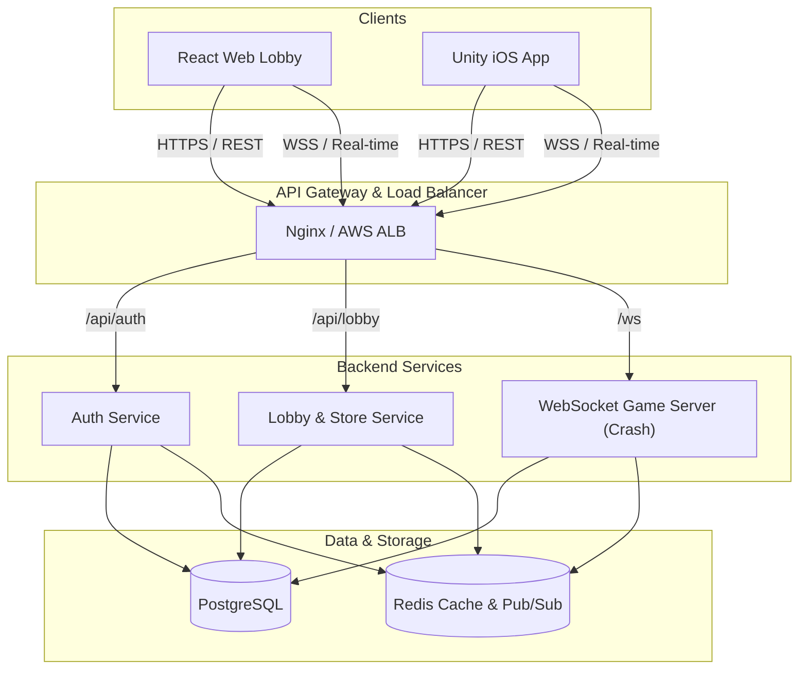
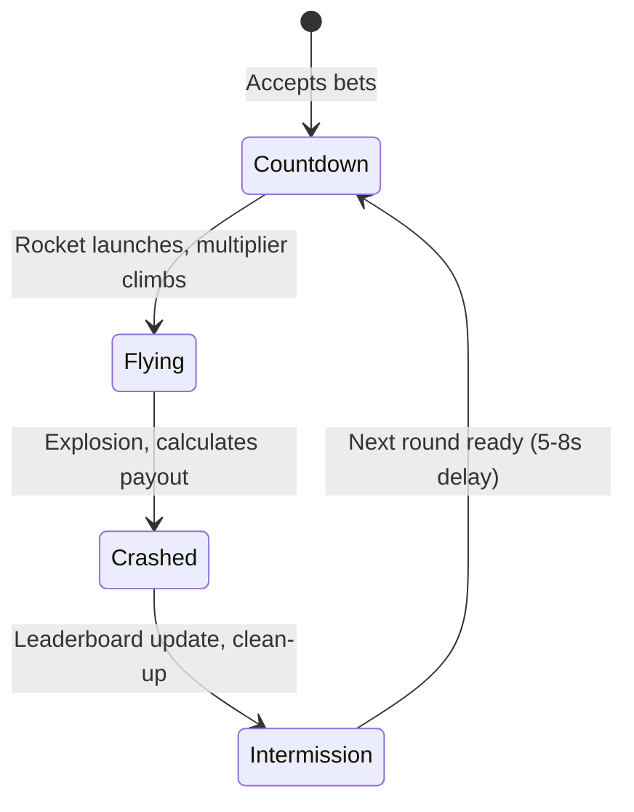

# CrashMania Clone — Backend & API Simulation Reference

> ⚠️ **Status**: **[POSTPONED / FOR REFERENCE ONLY]**
>
> **Scope**: This document defines the standard backend services, REST API, WebSocket protocol, database schema, and provably fair math engine for the live CrashMania platform.
> For this **iOS Mobile Test Application**, the physical server infrastructure is postponed. Instead, this specification is implemented as a **high-fidelity client-side MockBackendService** within Unity, simulating every payload, timing sequence, and curve equation defined herein to make the app 100% self-contained and immediately runnable.

---

## 1. System Architecture

The backend is designed as a secure, scalable, and modular system consisting of stateful real-time game servers, stateless web API servers, and persistent data storage.



### 1.1 Tech Stack Recommendation
* **Web & API Framework**: Node.js (Express / Fastify) or Go (Gin / Fiber) for high throughput and low latency.
* **WebSocket Server**: Node.js `ws` library or Go `gorilla/websocket` with Redis Pub/Sub for clustering.
* **Databases**:
  * **PostgreSQL**: Primary transactional database (users, balances, purchases, transactions, game history).
  * **Redis**: Fast session management, auth token blocklists, real-time leaderboards, cache for active game lobby state, and Pub/Sub messages between scaled game servers.
* **Hosting**: AWS ECS / EKS (Docker containers) with CloudFront CDN for game assets and builds.

---

## 2. Authentication & Authorization

All API endpoints (except public ones like login/signup) require a standard JSON Web Token (JWT) authorization header:
```text
Authorization: Bearer <access_token>
```

### 2.1 Token Lifecycle
* **Access Token**: Short-lived (6 hours), JWT format, signed with HS256/RS256. Contains `userId`, `displayName`, and token type.
* **Refresh Token**: Long-lived (30 days), stored securely on the database to track active user sessions and allow silent renewal.
* **Authorization Protocol**: When the Access Token expires (returning `401 Unauthorized`), the client calls `/api/auth/refresh` with the Refresh Token to get a new Access Token.

### 2.2 Auth Endpoints

#### POST `/api/auth/register`
Creates a new player account.
* **Request Body**:
  ```json
  {
    "email": "player@example.com",
    "password": "SecurePassword123",
    "displayName": "LuckyRocket"
  }
  ```
* **Success Response (201 Created)**:
  ```json
  {
    "success": true,
    "accessToken": "ey...",
    "refreshToken": "rf...",
    "profile": {
      "id": "usr_902183",
      "email": "player@example.com",
      "displayName": "LuckyRocket",
      "avatarUrl": "https://cdn.crashmania.com/avatars/default.png",
      "balanceCC": 110000.0,
      "balanceSC": 2.00,
      "vipTier": 1
    }
  }
  ```

#### POST `/api/auth/login`
Authenticates a user via email and password.
* **Request Body**:
  ```json
  {
    "email": "player@example.com",
    "password": "SecurePassword123"
  }
  ```
* **Success Response (200 OK)**:
  Same structure as Register response.

#### POST `/api/auth/google`
Authenticates or registers a user via Google OAuth ID token.
* **Request Body**:
  ```json
  {
    "idToken": "google_credential_token_string"
  }
  ```
* **Success Response (200 OK)**:
  Same structure as Login response.

#### POST `/api/auth/refresh`
Generates a new access token using a refresh token.
* **Request Body**:
  ```json
  {
    "refreshToken": "rf..."
  }
  ```
* **Success Response (200 OK)**:
  ```json
  {
    "success": true,
    "accessToken": "new_ey...",
    "refreshToken": "new_rf..."
  }
  ```

#### POST `/api/auth/logout`
Revokes the refresh token and signs out the user.
* **Request Body**:
  ```json
  {
    "refreshToken": "rf..."
  }
  ```
* **Success Response (200 OK)**:
  ```json
  {
    "success": true
  }
  ```

---

## 3. Lobby & Catalog API

Provides metadata about available categories, active games, promotional materials, and user stats.

### 3.1 GET `/api/lobby`
Fetches all necessary data to construct the main lobby dashboard (banners, categories, top-played games).
* **Success Response (200 OK)**:
  ```json
  {
    "banners": [
      {
        "id": "ban_001",
        "imageUrl": "https://cdn.crashmania.com/banners/welcome_promo.png",
        "linkTo": "/store",
        "priority": 1
      }
    ],
    "categories": [
      {
        "id": "cat_crash",
        "name": "Crash Games",
        "icon": "icon_rocket",
        "games": [
          {
            "id": "game_crash_original",
            "name": "Crash Original",
            "thumbnail": "https://cdn.crashmania.com/games/crash_thumb.png",
            "provider": "internal",
            "type": "crash",
            "iframeUrl": "https://game-builds.crashmania.com/crash/index.html",
            "sceneAddress": "Games/Crash",
            "isNew": false,
            "isFeatured": true,
            "supportsSC": true
          }
        ]
      }
    ],
    "topGames": [
      {
        "id": "game_crash_original",
        "name": "Crash Original",
        "thumbnail": "https://cdn.crashmania.com/games/crash_thumb.png",
        "provider": "internal",
        "type": "crash",
        "iframeUrl": "https://game-builds.crashmania.com/crash/index.html",
        "sceneAddress": "Games/Crash",
        "isNew": false,
        "isFeatured": true,
        "supportsSC": true
      }
    ]
  }
  ```

### 3.2 GET `/api/player/profile`
Retrieves the authenticated player's complete profile and dynamic balances.
* **Success Response (200 OK)**:
  ```json
  {
    "id": "usr_902183",
    "email": "player@example.com",
    "displayName": "LuckyRocket",
    "avatarUrl": "https://cdn.crashmania.com/avatars/default.png",
    "balanceCC": 250000.0,
    "balanceSC": 5.00,
    "vipTier": 1,
    "xp": 450,
    "xpToNextLevel": 1000
  }
  ```

---

## 4. Store & Payment Flow

CrashMania operates on a **dual-currency sweepstakes model**:
1. **Crash Coins (CC)**: Play currency. Purchased directly by players. CC has zero monetary value.
2. **Sweep Coins (SC)**: Promotional prize currency. Given out as free bonuses alongside CC purchases. Redeemable for real cash prizes once verified.

### 4.1 GET `/api/store/packages`
Retrieves store listings showing available coin bundles and free bonus SC awards.
* **Success Response (200 OK)**:
  ```json
  [
    {
      "id": "pkg_tier_1",
      "coinAmount": 250000,
      "bonusSC": 5.00,
      "priceUSD": 4.99,
      "isSpecial": false,
      "iconUrl": "https://cdn.crashmania.com/store/pack1.png"
    },
    {
      "id": "pkg_tier_2",
      "coinAmount": 1000000,
      "bonusSC": 20.00,
      "priceUSD": 19.99,
      "isSpecial": true,
      "iconUrl": "https://cdn.crashmania.com/store/pack2.png"
    }
  ]
  ```

### 4.2 POST `/api/store/purchase`
Initiates a secure payment flow for a selected package.
* **Request Body**:
  ```json
  {
    "packageId": "pkg_tier_1",
    "paymentMethod": "card",
    "deviceType": "ios" 
  }
  ```
* **Success Response (200 OK)**:
  ```json
  {
    "success": true,
    "transactionId": "txn_894372",
    "status": "pending",
    "redirectUrl": "https://pay.crashmania.com/checkout/txn_894372"
  }
  ```
  > [!NOTE]
  > For mobile environments, this URL is loaded in a secure web sheet (SFSafariViewController) or native payment sheet.

### 4.3 POST `/api/store/webhook`
Private endpoint called by third-party payment processors (SafeCharge, Pay.com) to confirm successful transactions.
* **Security**: Enforces signature hashing using a shared payment webhook secret key.
* **Success Action**: Adjusts database balances and notifies the client of the update via WebSocket or short polling.

---

## 5. Bonuses & Rewards System

To maintain player engagement, the backend supports multiple scheduled bonus trackers.

| Bonus Type | Periodicity | Reward Value |
|------------|-------------|--------------|
| **Welcome Gift** | Once per account | 110,000 CC + 2 SC |
| **Hourly Bonus** | Every 2 hours | 10,000 CC (Scales with VIP Level) |
| **Daily Streak** | 24-hour cycle | Day 1–7 escalating rewards. Day 7 gives 1 SC. |
| **Monthly Calendar** | Calendar month | Day 1-30 consecutive sign-in checkpoints. |

### 5.1 GET `/api/bonuses/status`
Fetches a list of all bonus timers and active streaks for the user.
* **Success Response (200 OK)**:
  ```json
  [
    {
      "type": "Welcome",
      "isAvailable": false,
      "secondsUntilAvailable": 0.0,
      "rewardAmountCC": 0.0,
      "rewardAmountSC": 0.0
    },
    {
      "type": "Hourly",
      "isAvailable": true,
      "secondsUntilAvailable": 0.0,
      "rewardAmountCC": 10000.0,
      "rewardAmountSC": 0.0
    },
    {
      "type": "DailyStreak",
      "isAvailable": false,
      "secondsUntilAvailable": 43200.0,
      "rewardAmountCC": 15000.0,
      "rewardAmountSC": 0.0,
      "streakDay": 3
    }
  ]
  ```

### 5.2 POST `/api/bonuses/claim`
Claims a specified bonus reward, immediately updating player ledger records in the database.
* **Request Body**:
  ```json
  {
    "type": "Hourly"
  }
  ```
* **Success Response (200 OK)**:
  ```json
  {
    "success": true,
    "awardedCC": 10000.0,
    "awardedSC": 0.0,
    "newBalanceCC": 260000.0,
    "newBalanceSC": 5.00
  }
  ```

---

## 6. Real-Time WebSocket Game Protocol (Crash Game)

The Crash game runs completely server-side. The client connects to the WebSocket instance and serves solely as a renderer/controller.

### 6.1 Connection Endpoint
```text
wss://crash.crashmania.com/ws?token={token}&gameType={gameType}&clientSeed={clientSeed}&gameSetId={gameSetId}
```
* **`token`**: JWT access token to authenticate.
* **`gameType`**: `0` for Virtual CC mode, `1` for Real SC mode.
* **`clientSeed`**: Optional public seed provided by client for RNG proof.

### 6.2 Game States
The server cycles infinitely through four states:



---

### 6.3 Server-to-Client Messages

The WebSocket exchanges structured JSON frames. Every message from the server uses the outer schema:
```typescript
interface ServerMessage {
  eventName: string;
  content: any;
}
```

#### A. `GAME_COUNTDOWN`
Pushed regularly during lobby prep.
* **Payload (`content`)**:
  ```json
  {
    "gameId": 894572,
    "secondsRemaining": 4.5
  }
  ```

#### B. `GAME_MULTIPLIER_UPDATE`
Broadcast at high-frequency (50ms interval) to animate rocket height.
* **Payload (`content`)**:
  ```json
  1.45
  ```

#### C. `CASH_OUT_RESULT`
Dispatched when a player cashes out successfully.
* **Payload (`content`)**:
  ```json
  {
    "userId": "usr_902183",
    "amount": 250.00,
    "multiplier": 1.85,
    "currency": "CC"
  }
  ```

#### D. `GAME_END`
Broadcast immediately upon rocket crash. Transmits the full cryptographic outcome verification.
* **Payload (`content`)**:
  ```json
  {
    "gameId": 894572,
    "startTime": "2026-05-27T00:05:00.000Z",
    "endDate": "2026-05-27T00:05:08.450Z",
    "multiplier": 2.45,
    "serverSeed": "e3b0c44298fc1c149afbf4c8996fb92427ae41e4649b934ca495991b7852b855",
    "clientSeed": "provably_fair_client_seed",
    "nonce": 105,
    "combinedHash": "f2d0e1c9b8a7f6e5d4c3b2a10987654321fedcba9876543210abcdef01234567"
  }
  ```

#### E. `PLAYER_BETS_UPDATE`
Sent when players enter or leave the active round's betting pool.
* **Payload (`content`)**:
  ```json
  [
    { "displayName": "RocketGod", "betAmount": 1000.0, "currency": "CC", "cashOut": null },
    { "displayName": "LuckyRocket", "betAmount": 100.0, "currency": "CC", "cashOut": 1.85 }
  ]
  ```

---

### 6.4 Client-to-Server Messages

#### A. Place Bet
```json
{
  "eventName": "PLACE_BET",
  "content": {
    "betAmount": 100.0,
    "currency": "CC",
    "autoCashOut": 2.50
  }
}
```

#### B. Cash Out
Sent when a player manually clicks Cash Out during the active flight phase.
```json
{
  "eventName": "CASH_OUT",
  "content": {}
}
```

#### C. Cancel Bet
Cancels a bet submitted during countdown before launch.
```json
{
  "eventName": "CANCEL_BET",
  "content": {}
}
```

---

## 7. Mathematical Model & Provably Fair Engine

To verify game integrity, every multiplier outcome must be pre-computable and cryptographically secure.

### 7.1 Real-Time Flight Curve
During the `Flying` phase, the rocket's climbing multiplier increments by seconds elapsed ($t$):
$$f(t) = 1.006^{100 \cdot t}$$

* At $t = 0.0$ seconds: $1.006^0 = 1.00\text{x}$
* At $t = 1.15$ seconds: $1.006^{115} \approx 2.00\text{x}$
* At $t = 2.00$ seconds: $1.006^{200} \approx 3.30\text{x}$
* At $t = 3.00$ seconds: $1.006^{300} \approx 10.96\text{x}$

### 7.2 Cryptographic Provably Fair Algorithm
The server pre-determines the exact crash point using three values:
1. **Server Seed**: A hex-encoded secret key.
2. **Client Seed**: A seed inputted by players (or generated randomly if none).
3. **Nonce**: An incrementing round index.

#### Logic Steps:
1. Combine client seed with nonce: `salt = clientSeed + "-" + nonce`
2. Generate the SHA-256 HMAC hash of the `salt` using the private `serverSeed` as the security key.
3. Parse the first 52 bits (13 hex characters) of the hash to a decimal integer ($X$).
4. Apply a **3% House Edge** instant crash check. If $X \pmod{100} < 3$, the multiplier is set to exactly `1.00x`.
5. If it survives, evaluate the final crash multiplier:
   $$Multiplier = \frac{97 \cdot 2^{52}}{2^{52} - X}$$
6. Floor the value to two decimal places (e.g. `2.45`).

---

## 8. Database Architecture Schema

Here is the structured entity relation table outline for primary server persistence.

### 8.1 Users Table (`users`)
Holds basic user account credentials and identity status.
* `id` (VARCHAR(36), PK): System identifier (e.g., `usr_902183`).
* `email` (VARCHAR(255), Unique): Account email address.
* `password_hash` (VARCHAR(255)): Securely hashed (bcrypt/argon2) password.
* `display_name` (VARCHAR(50)): Custom screen username.
* `avatar_url` (VARCHAR(255)): URL reference for profile icons.
* `vip_tier` (INTEGER): User loyalty bracket (defaults to `1`).
* `created_at` (TIMESTAMP): Creation date.

### 8.2 Balances Table (`user_balances`)
Dedicated financial transaction records ledger to prevent atomic race conditions.
* `user_id` (VARCHAR(36), PK, FK): Direct link to user.
* `balance_cc` (DECIMAL(20,2)): Persistent Play Coins amount.
* `balance_sc` (DECIMAL(10,2)): Persistent sweepstakes prize Sweep Coins balance.
* `xp` (INTEGER): User progression points.

### 8.3 Store Packages Table (`store_packages`)
Matches current shop package inventory items.
* `id` (VARCHAR(36), PK): Pack identifier.
* `coin_amount` (BIGINT): Crash Coins awarded.
* `bonus_sc` (DECIMAL(10,2)): Sweep Coins added.
* `price_usd` (DECIMAL(10,2)): USD package cost.

### 8.4 Transactions Table (`transactions`)
Ledger entries tracking store purchases and player deposits.
* `id` (VARCHAR(36), PK): Direct invoice trace.
* `user_id` (VARCHAR(36), FK): Associated player account.
* `package_id` (VARCHAR(36), FK): Purchased inventory product.
* `payment_provider` (VARCHAR(50)): Processed by `pay.com`, `apple_iap`, etc.
* `amount_usd` (DECIMAL(10,2)): Total invoice dollars.
* `status` (VARCHAR(20)): Transaction status (`pending`, `completed`, `failed`).
* `created_at` (TIMESTAMP).

### 8.5 Game History Table (`game_rounds`)
Records historical database profiles for every individual game round.
* `id` (BIGINT, PK): Game round identifier (e.g., `894572`).
* `game_type_id` (VARCHAR(50)): Type identifier (`game_crash_original`, `slots`, etc.).
* `crash_multiplier` (DECIMAL(10,2)): Final multiplier outcome.
* `server_seed` (VARCHAR(64)): Secret hashing token.
* `client_seed` (VARCHAR(64)): Public input value.
* `nonce` (BIGINT): Round sequence number.
* `created_at` (TIMESTAMP).
