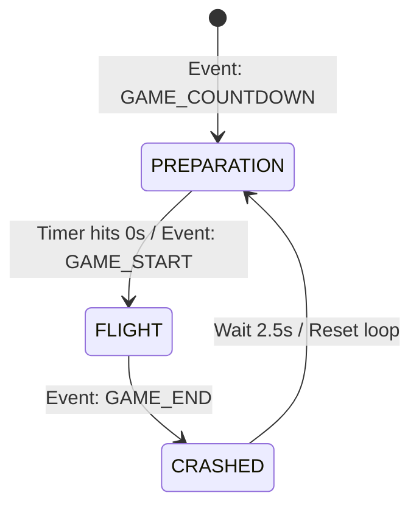

# CrashMania Clone — Crash Game Machine Specification

> **Scope**: This document defines the native C# architecture, visual animation engine, user interface, and mathematical curve systems for the **Crash Game Machine (Game Room)** embedded inside the Unity mobile application.
> It serves as the definitive layout and scripting reference for building the core game room module.

---

## 1. Scene Layout & UI Hierarchy

The Crash Game scene (`Game.unity`) is loaded additively by the Lobby shell's `IGameLoader` system. It covers the full viewport, masking the background lobby.

```
┌────────────────────────────────────────────────────────┐
│  [← Back]  [Level]  [CC 💰 122 420] [ + ]   [Toggle] [☰]│  ← Game Header
├────────────────────────────────────────────────────────┤
│ ┌────────────────────────────────────────────────────┐ │
│ │  [1.31] [4.76] [4.34] [2.62] [1.75] [1.83] [Hist]  │ │  ← Round History Pills
│ │                                                    │ │
│ │                                                    │ │
│ │                  ROCKET FLIGHT VIEWPORT            │ │
│ │                                                    │ │
│ │                       🚀 (climbing rocket)         │ │
│ │               x1.51 (multiplier text)              │ │
│ │                                                    │ │
│ └────────────────────────────────────────────────────┘ │
├────────────────────────────────────────────────────────┤
│  PLAYER           BET           MULTI          WIN  [v]│  ← Active Players (Collapsible)
│  alex****n...     20,000        x1.96          39,200  │
├────────────────────────────────────────────────────────┤
│ ┌────────────────────────────────────────────────────┐ │
│ │   [ - ]     6K      [ + ]   ┌────────────────────┐ │ │  ← Bet Panel 1
│ │   [10K] [20K] [40K] [60K]   │       BET          │ │ │
│ │                             │      [CC] 6K       │ │ │
│ │   [|||] [ ] AUTOPLAY        └────────────────────┘ │ │
│ └────────────────────────────────────────────────────┘ │
├────────────────────────────────────────────────────────┤
│ ┌────────────────────────────────────────────────────┐ │
│ │   [ - ]     6K      [ + ]   ┌────────────────────┐ │ │  ← Bet Panel 2
│ │   [10K] [20K] [40K] [60K]   │       BET          │ │ │
│ │                             │      [CC] 6K       │ │ │
│ │   [|||] [ ] AUTOPLAY        └────────────────────┘ │ │
│ └────────────────────────────────────────────────────┘ │
└────────────────────────────────────────────────────────┘
```

### 1.1 UI Component Tree (UGUI Canvas)
```text
GameCanvas (Render Mode: Screen Space - Camera, Match: 0.5)
├── SafeAreaPanel (Adjusts for iPhone Dynamic Island / Safe Indicator)
│   ├── GameHeader
│   │   ├── BackButton (Triggers exit notification back to lobby)
│   │   ├── LevelBadge (Hexagon with current level)
│   │   ├── BalanceWidget (Displays play/sweep coins via AccumulateToBalance)
│   │   ├── CurrencyToggle (Switch between CC and SC modes)
│   │   └── MenuButton (Hamburger menu)
│   │
│   ├── ViewportContainer (Masked, contains flight visual canvas)
│   │   ├── RoundHistoryOverlay (Horizontal scroll, pill badges in top left)
│   │   ├── ScrollingGridBackground (Material offset shader representing travel)
│   │   ├── SpaceParticles (Star/asteroid particles traveling downward/leftward)
│   │   ├── RocketContainer (RigidBody or RectTransform tracking flight curve path)
│   │   │   ├── RocketSprite (Animated thrusters)
│   │   │   └── FlameParticleSystem (Intensity increases with speed)
│   │   ├── ExplosionEffectPrefab (Deactivated, plays splash/fire on crash)
│   │   └── MultiplierText (TMP, centered, sizes up slightly on every tick)
│   │
│   ├── ActiveBetsAccordion (Collapsible list)
│   │   ├── Header (PLAYER, BET, MULTI, WIN texts + expand/collapse toggle)
│   │   └── ActiveBetsPanel (Vertical scroll, player rows matching simulated players)
│   │
│   └── DualBetContainer (VerticalLayoutGroup, two BetPanels stacked vertically)
│       ├── BetPanel_A (Controls bet index 0)
│       └── BetPanel_B (Controls bet index 1)
```

---

## 2. Dynamic Rocket Flight Engine

The game viewport visualizes high-velocity motion. Rather than flying the rocket infinitely into space (which would exceed floating-point boundaries), the camera remains locked, and **environmental elements scroll relative to the flight multiplier**.

### 2.1 Space Physics Simulation
* **Scrolling Grid**: A standard checkerboard/space-grid material whose texture offset scales exponentially with the active multiplier value.
* **Particle Clusters**: Three layered particle systems (Background stars, Midground space dust, Foreground meteorites) simulating 2.5D depth. The particle velocity is modified in real-time by the multiplier velocity.
* **Parabolic Float**: The rocket sprite sits at a baseline `(X: -100, Y: -150)` in local space during countdown. Upon launch, it translates along a parabolic curve `y = a * x^2` up to a centered target threshold `(X: 50, Y: 50)`. Once there, it remains centered, executing a micro-noise breathing scale `sin(Time.time * frequency) * amplitude` representing atmospheric friction.

### 2.2 Numerical Curves & Mathematics
The rocket updates its client-side multiplier using elapsed flying seconds ($t$):
$$f(t) = 1.006^{100 \cdot t}$$

```csharp
public class CrashCurveEvaluator
{
    // Evaluates current multiplier at elapsed seconds
    public static double GetMultiplierAtTime(float seconds)
    {
        return Math.Pow(1.006, 100f * seconds);
    }

    // Evaluates the reverse: returns elapsed seconds needed to reach target multiplier
    public static float GetTimeAtMultiplier(double multiplier)
    {
        return (float)(Math.Log(multiplier) / (100f * Math.Log(1.006)));
    }
}
```

---

## 3. Dual-Bet Control Mechanics

A defining element of high-fidelity social casino crash games is the **Dual-Bet Controller**. This allows users to set two distinct betting profiles (e.g., placing one small bet with high auto-cashout, and a larger bet intended for manual early cashout).

### 3.1 Bet Panel UI Prefab (`BetPanel.prefab`)
Each panel contains:
1. **Bet Input**: Text field + `[-][+]` increment buttons, and quick action buttons (`10K`, `20K`, `40K`, `60K`, `80K`).
2. **Autoplay Toggle**: Switch to enable automated betting.
3. **Interactive Action Button**: A large colored button on the right side transitioning across states:
   * **State A: Betting Inactive (Green CTA)**: `"PLACE BET"` -> Submits bet parameters to active pool.
   * **State B: Betting Pending (Yellow CTA)**: `"CANCEL BET"` -> Retracts bet before flight begins.
   * **State C: Active Flight (Orange CTA)**: `"CASH OUT"` -> Instantly lock current multiplier.
   * **State D: Active Flight Locked (Muted Gray)**: `"BET PLACED (NEXT ROUND)"` -> Submits bet automatically for the upcoming round.

---

## 4. State Machine & Event Handling

The Crash game room runs under a strict client-side state machine. State changes are driven by incoming messages from the local `MockBackendService` (simulating actual server socket inputs).



### 4.1 State Logic Mappings

#### A. PREPARATION Phase
* **Lobby / Game Action**: Multiplier text shows countdown `Next round in 5.4s`. The rocket sprite sits at the bottom-left thrusters pulsing.
* **Betting UI**: "PLACE BET" buttons are active. User can cancel pending bets.
* **Sidebar**: Active players' board populates with mock competitors placing bets.

#### B. FLIGHT Phase
* **Lobby / Game Action**: Multiplier starts ascending from `1.00x`. Rocket fires main thrusters, launches parabolic arc, and stars scroll.
* **Betting UI**: "PLACE BET" buttons transition to big Orange `"CASH OUT [Amount]"` CTAs showing real-time payout based on current multiplier.
* **Cash-Out Processing**: 
  * Player taps Cash Out -> Client fires C# event `/CASH_OUT`.
  * The mock backend validates transaction and returns `CASH_OUT_RESULT`.
  * Balance widget triggers `AnimateToBalance` showing coins flying into the ledger. Button goes inactive.

#### C. CRASHED Phase
* **Lobby / Game Action**: Rocket sprite disappears, replaced by an explosion particle splat. Screen shakes (camera offset animation). Text turns error red: `CRASHED @ 2.45x`.
* **Betting UI**: Action buttons freeze. Uncollected bets are marked as lost.
* **History**: The crash value (`2.45x`) is added to the left of the history badge bar.

---

## 5. Reconstructed Unity Scripts

Implement these core game room components inside `Assets/Scripts/Crashmania/Game/` to drive calculations and view states.

### 5.1 `CrashGameController.cs`
Binds the layout view components and orchestrates simulated events.

```csharp
using UnityEngine;
using System;
using System.Collections.Generic;
using Crashmania;

public class CrashGameController : MonoBehaviour, IGameController
{
    public static CrashGameController Instance { get; private set; }

    [Header("UI Panel Links")]
    [SerializeField] private TMPro.TextMeshProUGUI multiplierText;
    [SerializeField] private RectTransform historyPillsContent;
    [SerializeField] private GameObject historyBadgePrefab;
    [SerializeField] private AccumulateToBalanceScript ccBalanceWidget;
    [SerializeField] private AccumulateToBalanceScript scBalanceWidget;

    [Header("Rocket Engine Links")]
    [SerializeField] private Transform rocketTransform;
    [SerializeField] private ParticleSystem flameParticles;
    [SerializeField] private GameObject explosionPrefab;
    [SerializeField] private ScrollingGridBackground spaceGrid;

    public event Action<double, double> OnBalanceChanged;
    public event Action OnRequestExit;

    private float flightTimer = 0f;
    private bool isFlying = false;
    private double currentMultiplier = 1.0;

    private void Awake()
    {
        Instance = this;
    }

    public void Initialize(GameSession session, SettingsProxy settings)
    {
        Debug.Log("[GameMachine] Initialized with session ID: " + session.SessionId);
        ResetGameRoom();
    }

    public void OnBalanceUpdated(double newCC, double newSC)
    {
        if (ccBalanceWidget != null) ccBalanceWidget.AnimateToBalance(newCC);
        if (scBalanceWidget != null) scBalanceWidget.AnimateToBalance(newSC);
    }

    public void OnSettingsChanged(bool musicOn, bool sfxOn)
    {
        // Adjust local Audio Mixer volumes matching music/SFX toggles
    }

    public void Shutdown()
    {
        ResetGameRoom();
        Debug.Log("[GameMachine] Shutting down room.");
    }

    public void ExitPressed()
    {
        OnRequestExit?.Invoke();
    }

    // Handles ticks driven by MockBackend WebSocket Simulation
    public void TickFlight(float elapsedSeconds)
    {
        if (!isFlying) return;

        flightTimer = elapsedSeconds;
        currentMultiplier = CrashCurveEvaluator.GetMultiplierAtTime(flightTimer);
        
        // Update Viewport elements
        if (multiplierText != null)
        {
            multiplierText.text = currentMultiplier.ToString("F2") + "x";
            // Scale pulse effect
            float pulse = 1f + 0.05f * Mathf.Sin(Time.time * 20f);
            multiplierText.transform.localScale = new Vector3(pulse, pulse, 1f);
        }

        if (spaceGrid != null)
        {
            // Scale scrolling offset speed with climbing multiplier
            spaceGrid.SetSpeedFactor((float)currentMultiplier);
        }
        
        // Parabolic translation path
        Vector3 rocketPos = rocketTransform.localPosition;
        if (rocketPos.x < 50f) rocketPos.x += Time.deltaTime * 50f;
        if (rocketPos.y < 50f) rocketPos.y += Time.deltaTime * 40f;
        rocketTransform.localPosition = rocketPos;
    }

    public void StartFlight()
    {
        isFlying = true;
        flightTimer = 0f;
        currentMultiplier = 1.0;
        explosionPrefab.SetActive(false);
        flameParticles.Play();
    }

    public void TriggerCrash(double crashPoint)
    {
        isFlying = false;
        flameParticles.Stop();
        explosionPrefab.SetActive(true);
        
        if (multiplierText != null)
        {
            multiplierText.text = $"CRASHED\n@{crashPoint:F2}x";
            multiplierText.color = Color.red;
        }

        AddHistoryPill(crashPoint);
    }

    private void AddHistoryPill(double crashVal)
    {
        if (historyBadgePrefab == null || historyPillsContent == null) return;
        
        GameObject pill = Instantiate(historyBadgePrefab, historyPillsContent);
        var text = pill.GetComponentInChildren<TMPro.TextMeshProUGUI>();
        text.text = $"{crashVal:F2}x";
        
        // Visual decoration based on height
        var image = pill.GetComponent<UnityEngine.UI.Image>();
        image.color = crashVal >= 2.0 ? new Color(0.54f, 0.24f, 0.92f) : new Color(0.28f, 0.32f, 0.39f);
        
        // Push to top of list visual
        pill.transform.SetAsFirstSibling();
    }

    private void ResetGameRoom()
    {
        isFlying = false;
        flightTimer = 0f;
        rocketTransform.localPosition = new Vector3(-100f, -150f, 0f);
        flameParticles.Stop();
        explosionPrefab.SetActive(false);
        if (multiplierText != null)
        {
            multiplierText.color = Color.white;
            multiplierText.text = "WAITING...";
        }
    }
}
```

---

### 5.2 `ScrollingGridBackground.cs`
Applies a fast, hardware-accelerated scroll effect directly to your viewport grid.

```csharp
using UnityEngine;
using UnityEngine.UI;

public class ScrollingGridBackground : MonoBehaviour
{
    [SerializeField] private RawImage targetImage;
    [SerializeField] private float baseScrollSpeedX = 0.05f;
    [SerializeField] private float baseScrollSpeedY = 0.04f;

    private Material targetMaterial;
    private Vector2 currentOffset = Vector2.zero;
    private float speedFactor = 1.0f;

    private void Start()
    {
        if (targetImage != null)
        {
            // Clone material instance to prevent asset tampering
            targetMaterial = Instantiate(targetImage.material);
            targetImage.material = targetMaterial;
        }
    }

    private void Update()
    {
        if (targetMaterial == null) return;

        // Animate offset matching current flying speed
        currentOffset.x += baseScrollSpeedX * speedFactor * Time.deltaTime;
        currentOffset.y += baseScrollSpeedY * speedFactor * Time.deltaTime;

        targetMaterial.SetTextureOffset("_MainTex", currentOffset);
    }

    public void SetSpeedFactor(float multiplier)
    {
        // Climb scroll velocity dynamically as the rocket climbs
        speedFactor = Mathf.Clamp(multiplier * 0.5f, 1f, 15f);
    }
}
```
