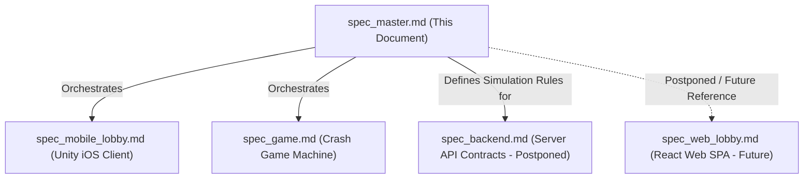
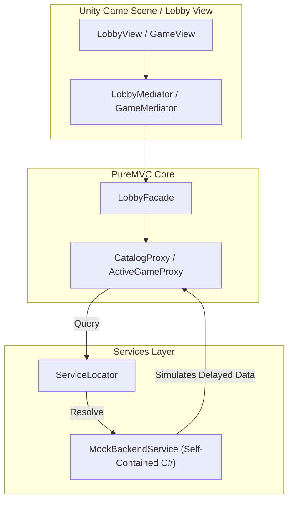
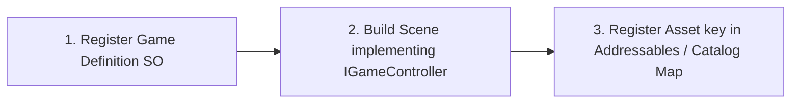

# CrashMania Clone — Master Architecture & Unity iOS Project Specification

> **Scope**: This master specification governs the entire CrashMania test application, coordinating the native **Unity iOS Mobile Client** design.
> It defines the unified directory layout, client-side mocked services architecture, centralized configurations, sweepstakes compliance definitions (postponed), and the system scalability roadmap.
>
> ⚠️ **Project Focus**: This is a high-fidelity **CTO-grade test application** targeting native **iOS (App Store)**. To ensure a flawless, ready-to-run showcase, the React Web Lobby and the physical backend servers are bypassed/postponed. The Unity application acts as a fully self-contained ecosystem embedding *both* the Lobby Shell and highly expandable Game Machines, utilizing a local mock backend service that simulates server endpoints and real-time WebSocket state machines.

---

## 1. Document Architecture Suite

The platform's blueprint is split into highly structured documentation files, maintaining clean division of concerns:



* 📄 **[Master Specification](file:///Users/vitaliivasylenko/Development/Unity/CrashmaniaEx/Project/spec_master.md)**: Coordinates monorepo files, hardcoded configuration sheets, postponed compliance items, and cross-module execution rules.
* 📄 **[Unity iOS Client Specification](file:///Users/vitaliivasylenko/Development/Unity/CrashmaniaEx/Project/spec_mobile_lobby.md)**: Focuses on scene-based layouts, PureMVC implementation mappings, design tokens, DOTween parameters, dynamic Addressable loaders, and UI prefabs.
* 📄 **[Crash Game Machine Specification](file:///Users/vitaliivasylenko/Development/Unity/CrashmaniaEx/Project/spec_game.md)**: Defines the physical flight curves, dual parallel bet controls, UGUI grid shaders, particle explosions, and active room controllers.
* 📄 **[Backend & API Specification](file:///Users/vitaliivasylenko/Development/Unity/CrashmaniaEx/Project/spec_backend.md)**: *[POSTPONED / FOR REFERENCE ONLY]* Outlines REST routes, real-time WebSocket packets, DB schemas, and HMAC math that our client-side C# mocked layer simulates.
* 📄 **[React Web Lobby Specification](file:///Users/vitaliivasylenko/Development/Unity/CrashmaniaEx/Project/spec_web_lobby.md)**: *[POSTPONED / FOR FUTURE USAGE]* Kept for future reference when porting the platform back to desktop browsers.

---

## 2. Directory Layout & Folder Structure

All assets, configurations, and decompilation research scripts are organized in a clean directory hierarchy:

```text
/CrashmaniaEx
├── /Project                  # Unity iOS Mobile Project (Matches spec_mobile_lobby.md)
│   ├── /Assets
│   │   ├── /Scenes           # Boot, Login, Lobby, Store, Gifts, Account, Game
│   │   ├── /Scripts
│   │   │   ├── /Core         # DI Containers, Startup triggers, and ServiceLocator
│   │   │   ├── /PureMvc      # Facade, Notifications, Proxies, Mediators, and Commands
│   │   │   ├── /Services     # Navigation, MockBackendService, and IGameLoader
│   │   │   ├── /Models       # Strongly-typed client models
│   │   │   ├── /UI           # Custom shaders (skew, gradients) and DOTween behaviors
│   │   │   └── /Game         # IGameController and specific Game Machine assemblies
│   │   ├── /UI               # Custom UGUI Prefabs, Sprites, Materials
│   │   └── /ScriptableObjects# Centralized configurations, MockData catalog files
│   └── /ProjectSettings      # Platform configuration settings
├── /Research                 # Legacy research, raw asset extractions, and decompilations
│   ├── /raw                  # Unpacked original lobby bundles
│   └── /deobfuscated         # Deobfuscated Javascript & C# script outlines
└── README.md                 # Project outline and startup details
```

---

## 3. Mocked Backend Architecture & Simulation

To enable immediate, zero-configuration startup on TestFlight or the Xcode simulator, the application completely skips physical server deployments. Instead, the backend is simulated entirely in memory inside the Unity project.

### 3.1 Architecture Overview
A central `MockBackendService` implements the `IBackendService` interface. It manages:
* **Stateless API Simulations**: Simple async/await methods using `UniTask.Delay` to simulate network roundtrips.
* **Stateful WebSocket Simulations**: A local timer/task dispatcher that simulates active game rooms.



### 3.2 High-Fidelity Crash Game Loop Simulation
For the Crash Game room, `MockBackendService` operates an infinite state-machine loop exactly mimicking the real WebSocket server timing:
1. **Countdown State (8 seconds)**: 
   * Ticks a countdown timer down from `8.0s` to `0.0s`.
   * Accepts bets through `/api/PLACE_BET` (adding mock usernames to the active players' list).
   * Generates a random cryptographic server seed and calculates the *exact final crash point* using the mathematical formula:
     $$Multiplier = \frac{97 \cdot 2^{52}}{2^{52} - X}$$
2. **Flying State (Dynamic)**:
   * Triggers a fast ticker (every 50ms) to increment the climbing multiplier using the mathematical curve:
     $$f(t) = 1.006^{100 \cdot t}$$
   * Dispatches events to update the game view rocket position.
   * If a user clicks Cash Out, instantly confirms success, updates the balance, and triggers particle effects.
3. **Crashed State (2.5 seconds)**:
   * Explodes the rocket visual, disables cash-outs, locks scores, and logs history.
4. **Intermission State (1.5 seconds)**:
   * Cleans lists, resets views, and starts the next countdown automatically.

---

## 4. Centralized Configurations & App Settings

To guarantee CTO-grade architectural design, we **completely bypass `.env` configurations**. No external text files are loaded at runtime. Instead, all configurations are consolidated into a **single, strongly-typed Unity ScriptableObject asset** that serves as the centralized settings repository.

### 4.1 Configuration ScriptableObject (`AppConfig.cs`)
```csharp
using UnityEngine;

[CreateAssetMenu(fileName = "AppConfig", menuName = "Lobby/App Configuration")]
public class AppConfig : ScriptableObject
{
    [Header("Environment & Endpoint Targets (Future Live Setup)")]
    [Tooltip("Target URL for real REST APIs when mock mode is off.")]
    public string apiBaseUrl = "https://api.crashmania.com/api";
    [Tooltip("Target URL for real game WebSockets when mock mode is off.")]
    public string webSocketUrl = "wss://crash.crashmania.com/ws";

    [Header("CTO Demo Mock Settings")]
    [Tooltip("Enables self-contained client-side simulation. Must be TRUE for this demo.")]
    public bool enableOfflineMocks = true;
    [Tooltip("Virtual delay (ms) for REST HTTP API simulations.")]
    public int mockNetworkDelayMs = 350;
    [Tooltip("Instant crash house edge (e.g. 0.03 for 3%).")]
    public float houseEdgeRate = 0.03f;

    [Header("Default User Starting Ledgers")]
    public double startingBalanceCC = 250000.0;
    public double startingBalanceSC = 5.00;
    public string demoUserDisplayName = "CTO_Guest";
    public int defaultVipTier = 1;

    [Header("Hourly Bonus Preferences")]
    public double hourlyBonusAmountCC = 10000.0;
    public double hourlyBonusIntervalSeconds = 7200f; // 2 hours

    [Header("Daily Streak Rewards (Day 1-7 CC Values)")]
    public double[] dailyStreakCcRewards = { 10000, 15000, 20000, 25000, 30000, 40000, 50000 };
    public double dailyStreakDay7ScBonus = 1.00;
}
```

### 4.2 Dependency Injection Setup
This single config asset is instantiated as an asset in the project and injected via the `DependencyContainer` on boot, keeping it decoupled and clean:
```csharp
// Startup.cs (MonoBehaviour on persistent Boot root)
private void Awake()
{
    // Load config from Resources or Inspector
    AppConfig config = Resources.Load<AppConfig>("AppConfig");
    
    // Register centralized config asset
    DependencyContainer.Instance.Register<AppConfig>(config);
    
    // Instantiate mock service matching config preferences
    DependencyContainer.Instance.Register<IBackendService>(new MockBackendService(config));
}
```

---

## 5. Expandable Architecture Roadmap (More Rooms & Games)

The lobby is designed to be completely **game-agnostic**. The core shell supports adding new rooms, slots, or instant games with zero structural changes to the lobby views or navigation routers.

### 5.1 Game Expansion Blueprint
Adding a new game to the mobile shell consists of three clean, isolated steps:



1. **Step 1: Create Game Definition Asset**
   Create a new asset instance of the `GameDefinition` ScriptableObject defining metadata, visual thumbnails, game type (`Slot`, `Table`, `Instant`), currency configurations, and scene references.
2. **Step 2: Implement `IGameController` in the Game Scene**
   Every new game scene's root object must implement the standard contract:
   ```csharp
   public interface IGameController
   {
       void Initialize(GameSession session, SettingsProxy settings);
       void OnBalanceUpdated(double newCC, double newSC);
       void OnSettingsChanged(bool musicOn, bool sfxOn);
       void Shutdown();
       
       event Action<double, double> OnBalanceChanged; // Delta balance reports
       event Action OnRequestExit;                    // Tells lobby to return home
   }
   ```
3. **Step 3: Register key in GameCatalogMap**
   Add the new scene to the Addressables registry or embedded scene catalog. The `CatalogProxy` automatically pulls the catalog from `MockBackendService`, spawning the new game card in the lobby carousels dynamically!

---

## 6. Postponed Sweepstakes Compliance (Planned Features)

To focus strictly on high-fidelity visual perfection and fluid gameplay for this CTO evaluation, compliance systems are documented in the specification but marked as **postponed** for live deployment.

### 6.1 Geolocation Restriction Check [POSTPONED]
* **Original Design**: Real-time IP geolocation verification to restrict Sweep Coins (SC) mode in Washington, Idaho, Michigan, and Nevada.
* **Demo Status**: Postponed. The SC currency toggle is fully unlocked for the CTO demonstration to allow unlimited testing of the sweepstakes features in any region.

### 6.2 KYC Age Gate & Verification [POSTPONED]
* **Original Design**: Direct integration with LexisNexis / Sumsub for liveness detection and ID upload scanning.
* **Demo Status**: Postponed. KYC is mocked as instantly approved (`kyc_status = APPROVED`) to keep onboarding fluid and frictionless for reviewers.

### 6.3 Mail-In AMOE Code Generation [POSTPONED]
* **Original Design**: Dynamic 30-day alphanumeric code generator with admin ledgers to record envelope submissions.
* **Demo Status**: Postponed. AMOE codes are generated in-app but credited immediately upon pressing the claim button, serving as an interactive demonstration.
