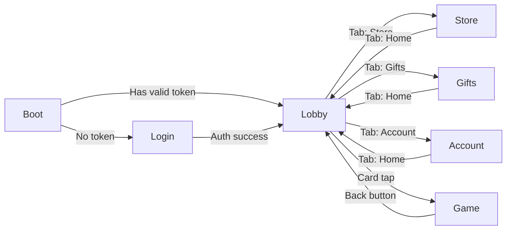

# CrashMania Clone — Mobile Lobby Specification (Unity / iOS)

> **Scope**: Pure Unity mobile application targeting **iOS (App Store)**. This spec covers the lobby shell, scene navigation, UI layout, mocked backend, and the plugin architecture for loading games.
> Game-specific specs live in separate documents. Backend server spec lives in `spec_backend.md`.

---

## 1. Product Vision

A native iOS social casino lobby built entirely in Unity (Canvas/UGUI), using the **PureMVC** architecture proven in LastOneOut. The lobby is a self-contained shell that:

- Displays game categories in scrollable carousels
- Supports a **dual-currency** sweepstakes model (Crash Coins + Sweep Coins)
- Loads games as **Addressable asset bundles** (future), mocked as embedded scenes for now
- Connects to a REST API + WebSocket backend (mocked locally, designed for easy swap to real services via `spec_backend.md`)

### Key Architectural Principles

| Principle | Implementation |
|-----------|---------------|
| **Game-agnostic shell** | Adding a game = registering a catalog entry + Addressable address. Zero lobby code changes. |
| **Backend-swappable** | All API calls go through a `IBackendService` interface. Mock implementation ships first; real HTTP implementation drops in later. |
| **PureMVC separation** | Views never touch data directly. All state flows through Proxies, all logic through Commands, all UI binding through Mediators. |
| **Addressable-ready** | Game scenes are referenced by Addressable keys, not hard scene names. For MVP, bundles are local; for production, they download from CDN. |

---

## 2. Target Platform & Build

| Property | Value |
|----------|-------|
| **Platform** | iOS (App Store) |
| **Unity Version** | Unity 6 (`6000.x`) |
| **Scripting Backend** | IL2CPP |
| **Target Architecture** | ARM64 |
| **Minimum iOS** | 16.0 |
| **UI System** | Canvas / UGUI (with TextMeshPro) |
| **Render Pipeline** | URP (2D) |
| **Orientation** | Portrait (lobby), Landscape allowed per-game |

---

## 3. Architecture Overview

### 3.1 High-Level Diagram

```mermaid
graph TD
    subgraph "Unity Application"
        FACADE["UnityFacade (PureMVC)"]
        
        subgraph "Proxies (State & Data)"
            AUTH_P["AuthProxy"]
            BALANCE_P["BalanceProxy"]
            CATALOG_P["CatalogProxy"]
            BONUS_P["BonusProxy"]
            SETTINGS_P["SettingsProxy"]
            GAME_P["ActiveGameProxy"]
        end
        
        subgraph "Commands (Business Logic)"
            LOGIN_C["LoginCommand"]
            LOAD_LOBBY_C["LoadLobbyDataCommand"]
            LAUNCH_GAME_C["LaunchGameCommand"]
            CLAIM_BONUS_C["ClaimBonusCommand"]
            PURCHASE_C["PurchaseStoreItemCommand"]
        end
        
        subgraph "Mediators & Views"
            LOBBY_M["LobbyMediator ↔ LobbyView"]
            STORE_M["StoreMediator ↔ StoreView"]
            GIFTS_M["GiftsMediator ↔ GiftsView"]
            ACCOUNT_M["AccountMediator ↔ AccountView"]
            HEADER_M["HeaderMediator ↔ HeaderView"]
            GAME_M["GameMediator ↔ GameView"]
        end
    end
    
    subgraph "Services (Injectable)"
        BACKEND["IBackendService"]
        MOCK["MockBackendService"]
        HTTP["HttpBackendService (future)"]
        ADDRESSABLES["IGameLoader"]
    end
    
    FACADE --> AUTH_P
    FACADE --> BALANCE_P
    FACADE --> CATALOG_P
    FACADE --> LOGIN_C
    FACADE --> LOAD_LOBBY_C
    FACADE --> LOBBY_M
    
    BACKEND -.-> MOCK
    BACKEND -.-> HTTP
    
    LOGIN_C --> BACKEND
    LOAD_LOBBY_C --> BACKEND
    LAUNCH_GAME_C --> ADDRESSABLES
```



### 3.2 PureMVC Mapping (Adapted from LastOneOut)

| LastOneOut | Mobile Lobby | Role |
|---|---|---|
| `UnityFacade` | `LobbyFacade` | Central registry. Registers all proxies, mediators, commands on startup. |
| `GameStateProxy` | `AuthProxy`, `BalanceProxy`, `CatalogProxy` | Domain-specific state holders |
| `GameSettingsProxy` | `SettingsProxy` | User preferences (sound, music, notifications) |
| `InGameView` / `InGameMediator` | `LobbyView` / `LobbyMediator`, etc. | One View+Mediator pair per screen |
| `ProcessPointerClickedCommand` | `LaunchGameCommand`, `ClaimBonusCommand` | Transient business logic |
| `DependencyContainer` | `ServiceLocator` | Resolves `IBackendService`, `IGameLoader`, `IAnalytics` via `[Inject]` |
| `AssetMap<TKey, TValue>` | `GameCatalogMap` | Strongly-typed lookup: `gameId → GameDefinition` |
| `Notifications.cs` | `LobbyNotifications.cs` | Central notification constants |

### 3.3 Dependency Injection

Reuse the exact `DependencyContainer` + `[Inject]` pattern from LastOneOut:

```csharp
// Startup.cs (MonoBehaviour on persistent root GO)
public class Startup : MonoBehaviour
{
    [SerializeField] private GameCatalogMap gameCatalog;
    [SerializeField] private DesignTokens designTokens;

    private void Awake()
    {
        var container = DependencyContainer.Instance;
        
        // Register services
        container.Register<IBackendService>(new MockBackendService());
        container.Register<IGameLoader>(new AddressableGameLoader());
        container.Register<GameCatalogMap>(gameCatalog);
        container.Register<DesignTokens>(designTokens);
        
        // Initialize PureMVC
        LobbyFacade.GetInstance().Startup();
    }
}
```

---

## 4. Scene Architecture

### 4.1 Scene Map

```
Scenes/
├── Boot.unity            # Splash + DI setup + auto-login attempt
├── Login.unity           # Login / Signup screen
├── Lobby.unity           # Main lobby (carousels, categories, promotions)
├── Store.unity           # Coin store
├── Gifts.unity           # Bonuses & rewards
├── Account.unity         # Profile, settings, history
└── Game.unity            # Game host (loads Addressable game content into this scene)
```

### 4.2 Scene Flow



### 4.3 Persistent Objects (DontDestroyOnLoad)

These GameObjects survive scene transitions:

| GameObject | Components | Purpose |
|-----------|------------|---------|
| `[Startup]` | `Startup.cs`, `DependencyContainer` | DI root, created once in Boot |
| `[LobbyFacade]` | `LobbyFacade.cs` | PureMVC singleton facade |
| `[AudioManager]` | `AudioManager.cs` | Background music + SFX pool |
| `[HeaderOverlay]` | `HeaderView.cs`, `Canvas` (sort order 100) | Persistent header bar across all scenes |
| `[TabBar]` | `TabBarView.cs`, `Canvas` (sort order 100) | Persistent bottom navigation |
| `[ModalManager]` | `ModalView.cs`, `Canvas` (sort order 200) | Modal overlay system |

### 4.4 Scene Loading

```csharp
public class NavigationService
{
    public async UniTask LoadScene(string sceneName, bool showTransition = true)
    {
        if (showTransition)
        {
            await TransitionOverlay.Instance.FadeIn(0.25f);
        }
        
        await SceneManager.LoadSceneAsync(sceneName);
        
        if (showTransition)
        {
            await TransitionOverlay.Instance.FadeOut(0.25f);
        }
        
        // PureMVC re-registers mediators for the new scene's views
        SendNotification(LobbyNotifications.SceneLoaded, sceneName);
    }
}
```

---

## 5. Design System (Unity UGUI)

### 5.1 Design Tokens ScriptableObject

```csharp
[CreateAssetMenu(fileName = "DesignTokens", menuName = "Lobby/Design Tokens")]
public class DesignTokens : ScriptableObject
{
    [Header("Backgrounds")]
    public Color bgMain = new Color(0.157f, 0.169f, 0.220f);       // #282b38
    public Color bgCard = new Color(0.227f, 0.259f, 0.314f);       // #3a4250
    public Color bgFooter = new Color(0.102f, 0.114f, 0.141f);     // #1a1d24
    public Color bgHeader = new Color(0.282f, 0.325f, 0.392f);     // #485364
    
    [Header("Brand")]
    public Color brandPurple = new Color(0.541f, 0.239f, 0.918f);  // #8a3dea
    public Color ctaBlueTop = new Color(0.310f, 0.667f, 1.000f);   // #4faaff
    public Color ctaBlueEnd = new Color(0.110f, 0.310f, 0.780f);   // #1c4fc7
    public Color accentYellow = new Color(0.996f, 0.867f, 0.141f); // #fedd24
    public Color accentGreen = new Color(0.059f, 0.824f, 0.314f);  // #0fd250
    
    [Header("Status")]
    public Color errorRed = new Color(1f, 0.247f, 0.235f);         // #ff3f3c
    
    [Header("Text")]
    public Color textPrimary = Color.white;
    public Color textSecondary = new Color(0.639f, 0.659f, 0.718f); // #a3a8b7
    
    [Header("Typography")]
    public TMP_FontAsset fontDefault;      // Murecho SemiBold (600)
    public TMP_FontAsset fontHeading;      // Murecho Bold (700)
    public TMP_FontAsset fontEmphasis;     // Murecho Black (900)
    public TMP_FontAsset fontDisplay;      // Saira Condensed Black (900)
}
```

### 5.2 Key Visual Language (UGUI)

| Pattern | UGUI Implementation |
|---------|-------------------|
| **Skew Transform** | Custom `SkewRect` component using `IMeshModifier` to shear vertices by -5° |
| **Gradient Buttons** | `GradientImage` component (vertex color gradient top→bottom on `Image`) |
| **Black Borders** | `Outline` component (2px, black) on card/button `Image` |
| **Shimmer Loading** | Animated UV offset shader on a `RawImage` with shimmer material |
| **Edge Fade Carousels** | Gradient `Image` overlays (left/right) on top of `ScrollRect` |
| **Glass Modals** | `CanvasGroup` with `blocksRaycasts=true` + dark overlay `Image` (alpha 0.7) |
| **Rounded Corners** | `RoundedCorners` shader or 9-slice sprites with rounded masks |

### 5.3 Responsive Layout

Since this is **portrait-only iOS** (not tablet-first), we design for a single canonical width and scale:

| Property | Value |
|----------|-------|
| Canvas Scaler mode | `Scale With Screen Size` |
| Reference Resolution | `1170 × 2532` (iPhone 14 Pro logical) |
| Match Width or Height | `0.5` (balanced) |
| Safe Area | `SafeAreaPanel` component auto-adjusts for notch/Dynamic Island |

---

## 6. Core UI Components (UGUI Prefabs)

### 6.1 HeaderBar (Persistent Overlay)

```
┌──────────────────────────────────────────────────────┐
│  [Logo]              [CC 💰 250,000] [SC 🟢 5.00]   │
└──────────────────────────────────────────────────────┘
Height: 120px (reference), safe-area-top padded
Canvas Sort Order: 100
```

**Prefab**: `UI/Prefabs/HeaderBar.prefab`
- **Logo**: `Image` (sprite), 214×94px
- **CC Display**: `HorizontalLayoutGroup` → coin icon `Image` + `TMP_Text` (fontEmphasis)
- **SC Display**: Same structure, green coin icon
- Balance values animated via `AccumulateToBalanceScript.cs`

### 6.2 TabBar (Persistent Bottom Nav)

```
┌────────┬────────┬────────┬────────┐
│  Home  │  Store │  Gifts │Account │
│   🏠   │   🛒   │   🎁   │   👤   │
└────────┴────────┴────────┴────────┘
Height: 150px (reference), safe-area-bottom padded
Canvas Sort Order: 100
```

**Prefab**: `UI/Prefabs/TabBar.prefab`
- 4 tab buttons, each: `VerticalLayoutGroup` → icon `Image` + label `TMP_Text`
- Active tab: `brandPurple` tint on icon, `textPrimary` label
- Inactive: `textSecondary` tint on both
- Tab press → `SendNotification(LobbyNotifications.NavigateTo, sceneName)`

### 6.3 GameCard

```
┌─────────────┐
│             │
│  Thumbnail  │   ← Image (loaded async via Addressables or URL)
│             │
├─────────────┤
│  Game Name  │   ← TMP_Text, fontDefault, 28px, centered
└─────────────┘
Width: 280px (reference)
```

**Prefab**: `UI/Prefabs/GameCard.prefab`
- `Button` component for tap handling
- Thumbnail: `RawImage` (supports async texture loading)
- Tap → `SendNotification(LobbyNotifications.LaunchGame, gameId)`
- Hover/press: `DOTween` scale punch 1.0 → 1.05 → 1.0

### 6.4 GameCard — Top 10 Variant

```
┌──────────────────────────────┐
│  ┌───┐  ┌──────────────┐    │
│  │ 1 │  │  Thumbnail   │    │
│  └───┘  └──────────────┘    │
│         Game Name            │
└──────────────────────────────┘
```

**Prefab**: `UI/Prefabs/GameCardTop10.prefab`
- Rank number: `TMP_Text` (fontDisplay / Saira Condensed Black), 96px, overlapping left
- `HorizontalLayoutGroup` with negative spacing for the overlap effect

### 6.5 GamesCarousel

```
┌──────────────────────────────────────────────────────┐
│  CATEGORY NAME                         [View All >]  │
│  ┌─────┐ ┌─────┐ ┌─────┐ ┌─────┐ ┌─────┐          │
│  │     │ │     │ │     │ │     │ │     │  ◁ swipe ▷ │
│  └─────┘ └─────┘ └─────┘ └─────┘ └─────┘          │
└──────────────────────────────────────────────────────┘
```

**Prefab**: `UI/Prefabs/GamesCarousel.prefab`
- Title: `TMP_Text` (fontHeading, 32px, uppercase)
- "View All" button: black bg, skewed, fontDefault 28px
- Content: `ScrollRect` (horizontal) → `HorizontalLayoutGroup` → `GameCard` instances
- Edge fades: gradient `Image` overlays on left/right (pointer-events off via `CanvasGroup`)
- Snapping: `ScrollRect` with custom `SnapToNearest` component

### 6.6 StoreItemCard

```
┌─────────────────┐
│    [coin icon]   │  ← skewed card, purple bg
│   💰 250,000     │
│   + 🟢 5.00 SC   │
│  ┌────────────┐  │
│  │   $4.99    │  │  ← black price bar
│  └────────────┘  │
└─────────────────┘
```

**Prefab**: `UI/Prefabs/StoreItemCard.prefab`
- Background: `Image` with `brandPurple` color + pattern sprite overlay
- Skew: `SkewRect` component (-5°)
- Coin values: `TMP_Text` (fontEmphasis)
- Price bar: child `Image` (black), anchored bottom, `TMP_Text` inside
- `Button` component → `SendNotification(LobbyNotifications.PurchaseItem, packageId)`

### 6.7 Modal System

```
┌── dark overlay (CanvasGroup alpha 0.7) ──────────┐
│                                                    │
│   ┌── modal panel ───────────────────────┐        │
│   │  [×]                                 │        │
│   │  Title (fontHeading, 36px)           │        │
│   │  Content area                        │        │
│   │  [Cancel]  [Confirm]                 │        │
│   └──────────────────────────────────────┘        │
│                                                    │
└────────────────────────────────────────────────────┘
Canvas Sort Order: 200
```

**Prefab**: `UI/Prefabs/ModalOverlay.prefab`
- Background: full-screen `Image` (black, alpha 0.7), `Button` to dismiss on tap outside
- Panel: `Image` (bgMain), rounded corners, shadow
- Managed by `ModalMediator` which queues and stacks modals
- Entry animation: `DOTween` — scale from 0.8 → 1.0 + fade from 0 → 1 over 0.25s
- Exit animation: reverse

---

## 7. PureMVC Registration

### 7.1 Notifications (`LobbyNotifications.cs`)

```csharp
public static class LobbyNotifications
{
    // Navigation
    public const string NavigateTo = "NavigateTo";
    public const string SceneLoaded = "SceneLoaded";
    
    // Auth
    public const string LoginRequest = "LoginRequest";
    public const string LoginSuccess = "LoginSuccess";
    public const string LoginFailed = "LoginFailed";
    public const string LogoutRequest = "LogoutRequest";
    
    // Data
    public const string LobbyDataLoaded = "LobbyDataLoaded";
    public const string BalanceUpdated = "BalanceUpdated";
    public const string CatalogUpdated = "CatalogUpdated";
    
    // Game
    public const string LaunchGame = "LaunchGame";
    public const string GameLoaded = "GameLoaded";
    public const string ExitGame = "ExitGame";
    
    // Store
    public const string PurchaseItem = "PurchaseItem";
    public const string PurchaseComplete = "PurchaseComplete";
    
    // Bonus
    public const string ClaimBonus = "ClaimBonus";
    public const string BonusClaimed = "BonusClaimed";
    public const string BonusTimerTick = "BonusTimerTick";
    
    // Settings
    public const string ToggleSound = "ToggleSound";
    public const string ToggleMusic = "ToggleMusic";
    
    // UI
    public const string ShowModal = "ShowModal";
    public const string HideModal = "HideModal";
    public const string ShowToast = "ShowToast";
}
```

### 7.2 Facade Startup (`LobbyFacade.cs`)

```csharp
public class LobbyFacade : Facade
{
    public void Startup()
    {
        // Register Proxies
        RegisterProxy(new AuthProxy());
        RegisterProxy(new BalanceProxy());
        RegisterProxy(new CatalogProxy());
        RegisterProxy(new BonusProxy());
        RegisterProxy(new SettingsProxy());
        RegisterProxy(new ActiveGameProxy());
        
        // Register Commands
        RegisterCommand(LobbyNotifications.LoginRequest, () => new LoginCommand());
        RegisterCommand(LobbyNotifications.NavigateTo, () => new NavigateCommand());
        RegisterCommand(LobbyNotifications.LaunchGame, () => new LaunchGameCommand());
        RegisterCommand(LobbyNotifications.PurchaseItem, () => new PurchaseStoreItemCommand());
        RegisterCommand(LobbyNotifications.ClaimBonus, () => new ClaimBonusCommand());
        RegisterCommand(LobbyNotifications.ExitGame, () => new ExitGameCommand());
        RegisterCommand(LobbyNotifications.SceneLoaded, () => new SceneLoadedCommand());
        
        // Note: Mediators are registered dynamically by SceneLoadedCommand
        // when each scene's root View calls RegisterMediator in its Awake()
    }
}
```

### 7.3 Example Proxy (`CatalogProxy.cs`)

```csharp
public class CatalogProxy : Proxy
{
    public new const string NAME = "CatalogProxy";
    public CatalogProxy() : base(NAME) { }

    [Inject] private IBackendService backend;

    public List<CategoryModel> Categories { get; private set; } = new();
    public List<GameModel> TopGames { get; private set; } = new();
    public List<BannerModel> Banners { get; private set; } = new();

    public override void OnRegister()
    {
        this.Inject(); // Resolve IBackendService
    }

    public async UniTask LoadLobbyData()
    {
        var response = await backend.GetLobbyData();
        Categories = response.Categories;
        TopGames = response.TopGames;
        Banners = response.Banners;
        SendNotification(LobbyNotifications.LobbyDataLoaded);
    }

    public List<GameModel> Search(string query)
    {
        return Categories
            .SelectMany(c => c.Games)
            .Where(g => g.Name.Contains(query, StringComparison.OrdinalIgnoreCase))
            .ToList();
    }
}
```

### 7.4 Example Command (`LaunchGameCommand.cs`)

```csharp
public class LaunchGameCommand : BaseCommand
{
    public override async void Execute(INotification notification)
    {
        base.Execute(notification);
        
        var gameId = (string)notification.Body;
        var catalogProxy = Facade.RetrieveProxy<CatalogProxy>();
        var authProxy = Facade.RetrieveProxy<AuthProxy>();
        var activeGameProxy = Facade.RetrieveProxy<ActiveGameProxy>();
        
        var gameDef = catalogProxy.GetGameById(gameId);
        if (gameDef == null) return;
        
        // Store active game context
        activeGameProxy.SetActiveGame(gameDef, authProxy.AccessToken);
        
        // Navigate to Game scene
        SendNotification(LobbyNotifications.NavigateTo, "Game");
    }
}
```

---

## 8. Backend Service Interface (Mock-First)

### 8.1 Interface Contract

```csharp
public interface IBackendService
{
    // Auth
    UniTask<AuthResponse> Login(string email, string password);
    UniTask<AuthResponse> LoginWithGoogle(string idToken);
    UniTask<AuthResponse> RefreshToken(string refreshToken);
    
    // Lobby
    UniTask<LobbyDataResponse> GetLobbyData();
    UniTask<PlayerProfile> GetPlayerProfile();
    
    // Store
    UniTask<List<StorePackage>> GetStorePackages();
    UniTask<PurchaseResult> PurchasePackage(string packageId);
    
    // Bonuses
    UniTask<BonusStatus> GetBonusStatus(BonusType type);
    UniTask<ClaimResult> ClaimBonus(BonusType type);
    
    // Game (used by game modules, not lobby directly)
    UniTask<GameSession> StartGameSession(string gameId, string accessToken);
}
```

### 8.2 Mock Implementation

```csharp
public class MockBackendService : IBackendService
{
    private PlayerProfile mockProfile = new()
    {
        Id = "mock-user-001",
        Email = "player@test.com",
        DisplayName = "TestPlayer",
        BalanceCC = 250000,
        BalanceSC = 5.00,
        VipTier = 1
    };

    public async UniTask<AuthResponse> Login(string email, string password)
    {
        await UniTask.Delay(500); // Simulate network
        return new AuthResponse
        {
            Success = true,
            AccessToken = "mock-jwt-token",
            RefreshToken = "mock-refresh-token",
            Profile = mockProfile
        };
    }

    public async UniTask<LobbyDataResponse> GetLobbyData()
    {
        await UniTask.Delay(300);
        return new LobbyDataResponse
        {
            Categories = MockCatalog.GenerateCategories(),
            TopGames = MockCatalog.GenerateTopGames(),
            Banners = MockCatalog.GenerateBanners()
        };
    }

    // ... other methods return mock data with simulated delays
}
```

### 8.3 Swapping to Real Backend

When `spec_backend.md` is implemented, the swap is a single line in `Startup.cs`:

```csharp
// Before (mock):
container.Register<IBackendService>(new MockBackendService());

// After (real):
container.Register<IBackendService>(new HttpBackendService("https://api.yourplatform.com"));
```

---

## 9. Data Models

```csharp
// --- Lobby ---
public class LobbyDataResponse
{
    public List<CategoryModel> Categories;
    public List<GameModel> TopGames;
    public List<BannerModel> Banners;
}

public class CategoryModel
{
    public string Id;
    public string Name;
    public string IconAddress;    // Addressable sprite key
    public List<GameModel> Games;
}

public class GameModel
{
    public string Id;
    public string Name;
    public string ThumbnailUrl;
    public string SceneAddress;   // Addressable scene key (e.g. "Games/Crash")
    public GameProvider Provider;
    public GameType Type;
    public bool IsNew;
    public bool IsFeatured;
    public bool SupportsSC;
}

public enum GameProvider { Internal, Mancala, Slotmill, Ela, Infin }
public enum GameType { Crash, Slot, Table, Instant }

// --- Auth ---
public class AuthResponse
{
    public bool Success;
    public string AccessToken;
    public string RefreshToken;
    public string ErrorMessage;
    public PlayerProfile Profile;
}

public class PlayerProfile
{
    public string Id;
    public string Email;
    public string DisplayName;
    public string AvatarUrl;
    public double BalanceCC;
    public double BalanceSC;
    public int VipTier;
}

// --- Store ---
public class StorePackage
{
    public string Id;
    public int CoinAmount;
    public double BonusSC;
    public double PriceUSD;
    public bool IsSpecial;
    public string IconAddress;
}

public class PurchaseResult
{
    public bool Success;
    public double NewBalanceCC;
    public double NewBalanceSC;
}

// --- Bonus ---
public enum BonusType { Hourly, DailyStreak, MonthlyCalendar, Welcome, MysteryWheel, Coinback }

public class BonusStatus
{
    public BonusType Type;
    public bool IsAvailable;
    public double SecondsUntilAvailable;
    public double RewardAmountCC;
    public double RewardAmountSC;
    public int StreakDay;         // For daily streak
}

public class ClaimResult
{
    public bool Success;
    public double AwardedCC;
    public double AwardedSC;
    public double NewBalanceCC;
    public double NewBalanceSC;
}

// --- Game ---
public class GameSession
{
    public string SessionId;
    public string WsUrl;
    public string AccessToken;
}

// --- Banner ---
public class BannerModel
{
    public string Id;
    public string ImageAddress;   // Addressable sprite key
    public string LinkRoute;
    public int Priority;
}
```

---

## 10. Game Loading (Addressable Architecture)

### 10.1 Current (MVP) — Embedded Scenes

For the first iteration, game scenes are included directly in the build:

```csharp
public class EmbeddedGameLoader : IGameLoader
{
    public async UniTask LoadGame(GameModel game)
    {
        // Game scene is already in Build Settings
        await SceneManager.LoadSceneAsync(game.SceneAddress, LoadSceneMode.Additive);
    }
    
    public async UniTask UnloadGame()
    {
        // Unload the additively-loaded game scene
        await SceneManager.UnloadSceneAsync(activeGameScene);
    }
}
```

### 10.2 Future — Remote Addressables

```csharp
public class AddressableGameLoader : IGameLoader
{
    public async UniTask LoadGame(GameModel game)
    {
        // Download bundle if not cached, then load scene
        var handle = Addressables.LoadSceneAsync(game.SceneAddress, LoadSceneMode.Additive);
        await handle.ToUniTask();
    }
    
    public async UniTask UnloadGame()
    {
        await Addressables.UnloadSceneAsync(activeHandle);
    }
}
```

### 10.3 Game Interface Contract

Every game scene must contain a root `GameObject` with a component implementing:

```csharp
public interface IGameController
{
    void Initialize(GameSession session, SettingsProxy settings);
    void OnBalanceUpdated(double newCC, double newSC);
    void OnSettingsChanged(bool musicOn, bool sfxOn);
    void Shutdown();
    
    event Action<double, double> OnBalanceChanged;  // CC delta, SC delta
    event Action OnRequestExit;
}
```

This is how the lobby communicates with any game — no React-Unity bridge, no `postMessage`. Pure C# interface.

---

## 11. Screen Wireframes (Portrait, iOS)

### 11.1 Lobby Screen

```
┌─────────────────────────────────┐
│ ▓▓▓▓▓▓▓▓▓▓▓▓▓▓▓▓▓▓▓▓▓▓▓▓▓▓▓▓ │  ← Safe area (Dynamic Island)
│                                 │
│  [Logo]     [💰 250k] [🟢 5.00]│  ← HeaderBar
├─────────────────────────────────┤
│ [🔍 Search]  [All][Crash][Slot] │  ← Sticky search + chips
├─────────────────────────────────┤
│ ┌─────────────────────────────┐ │
│ │   🎰 PROMO BANNER          │ │  ← Auto-scroll carousel
│ │   [● ○ ○]                  │ │
│ └─────────────────────────────┘ │
│                                 │
│ FEATURED              [View All]│
│ ┌─────┐┌─────┐┌─────┐┌─────┐  │  ← Horizontal scroll
│ │     ││     ││     ││     │  │
│ └─────┘└─────┘└─────┘└─────┘  │
│ Name   Name   Name   Name     │
│                                 │
│ TOP 10                [View All]│
│ ┌──────────┐┌──────────┐      │
│ │1 [thumb] ││2 [thumb] │ ◁▷   │
│ └──────────┘└──────────┘      │
│                                 │
│ CRASH GAMES           [View All]│
│ ┌─────┐┌─────┐┌─────┐         │
│ └─────┘└─────┘└─────┘         │
│                                 │
├─────────────────────────────────┤
│  🏠 Home  🛒 Store  🎁 Gifts  👤│  ← TabBar
│ ▓▓▓▓▓▓▓▓▓▓▓▓▓▓▓▓▓▓▓▓▓▓▓▓▓▓▓▓ │  ← Safe area (home indicator)
└─────────────────────────────────┘
```

### 11.2 Game Screen

```
┌─────────────────────────────────┐
│ ▓▓▓▓▓▓▓▓▓▓▓▓▓▓▓▓▓▓▓▓▓▓▓▓▓▓▓▓ │
│ [← Back]  CRASH   [💰] [🟢]   │  ← Game header (replaces lobby header)
├─────────────────────────────────┤
│                                 │
│                                 │
│         GAME CONTENT            │  ← Loaded via IGameLoader
│     (fills available space)     │
│                                 │
│                                 │
├─────────────────────────────────┤
│  [BET CONTROLS PANEL]          │  ← Provided by game, not lobby
│  Amount [___] [½][2×][Max]     │
│  [        PLACE BET         ]  │
├─────────────────────────────────┤
│  No TabBar in game mode         │
└─────────────────────────────────┘
```

---

## 12. Animations

| Animation | Tool | Duration | Usage |
|-----------|------|----------|-------|
| Scene transition fade | `DOTween` CanvasGroup alpha | 0.25s | Between scenes |
| Card press scale | `DOTween` Transform | 0.15s | GameCard tap feedback |
| Balance counter | `DOTween` float + `TMP_Text` | 0.5s, ease-out cubic | Currency display update |
| Carousel snap | Custom `ScrollRect` + `DOTween` | 0.3s | Snap to nearest card |
| Modal enter | `DOTween` scale 0.8→1 + fade | 0.25s | Modal popup entry |
| Modal exit | `DOTween` scale 1→0.8 + fade | 0.2s | Modal popup exit |
| Shimmer loading | Shader UV offset | 2s infinite | Skeleton card placeholders |
| Tab switch | `DOTween` color + scale | 0.15s | TabBar active state toggle |
| Toast slide-in | `DOTween` anchoredPosition | 0.3s + 2s hold + 0.3s out | Notification toasts |
| Promo banner scroll | `DOTween` Sequence | 5s auto, 0.4s swipe | Banner carousel auto-advance |

---

## 13. Third-Party Dependencies

| Package | Purpose | Source |
|---------|---------|--------|
| **PureMVC** | MVC framework | NuGet / manual DLL |
| **DOTween Pro** | Animation engine | Asset Store |
| **TextMeshPro** | Advanced text rendering | Unity built-in package |
| **UniTask** | Async/await for Unity | OpenUPM / GitHub |
| **Addressables** | Asset bundle management | Unity built-in package |
| **Newtonsoft JSON** | JSON serialization (for HTTP API) | Unity built-in package |
| **NativeGallery** (optional) | Avatar photo picker | GitHub |

---

## 14. File Structure (Unity Project)

```
Assets/
├── Scenes/
│   ├── Boot.unity
│   ├── Login.unity
│   ├── Lobby.unity
│   ├── Store.unity
│   ├── Gifts.unity
│   ├── Account.unity
│   └── Game.unity
│
├── Scripts/
│   ├── Core/
│   │   ├── Startup.cs                     # DI + Facade init
│   │   ├── DependencyContainer.cs         # [Inject] resolver
│   │   ├── InjectAttribute.cs
│   │   └── ServiceLocator.cs
│   │
│   ├── PureMvc/
│   │   ├── LobbyFacade.cs
│   │   ├── Notifications/
│   │   │   └── LobbyNotifications.cs
│   │   ├── Proxies/
│   │   │   ├── AuthProxy.cs
│   │   │   ├── BalanceProxy.cs
│   │   │   ├── CatalogProxy.cs
│   │   │   ├── BonusProxy.cs
│   │   │   ├── SettingsProxy.cs
│   │   │   └── ActiveGameProxy.cs
│   │   ├── Commands/
│   │   │   ├── Auth/
│   │   │   │   └── LoginCommand.cs
│   │   │   ├── Navigation/
│   │   │   │   ├── NavigateCommand.cs
│   │   │   │   └── SceneLoadedCommand.cs
│   │   │   ├── Game/
│   │   │   │   ├── LaunchGameCommand.cs
│   │   │   │   └── ExitGameCommand.cs
│   │   │   ├── Store/
│   │   │   │   └── PurchaseStoreItemCommand.cs
│   │   │   └── Bonus/
│   │   │       └── ClaimBonusCommand.cs
│   │   ├── Mediators/
│   │   │   ├── HeaderMediator.cs
│   │   │   ├── TabBarMediator.cs
│   │   │   ├── ModalMediator.cs
│   │   │   ├── Lobby/
│   │   │   │   └── LobbyMediator.cs
│   │   │   ├── Store/
│   │   │   │   └── StoreMediator.cs
│   │   │   ├── Gifts/
│   │   │   │   └── GiftsMediator.cs
│   │   │   ├── Account/
│   │   │   │   └── AccountMediator.cs
│   │   │   └── Game/
│   │   │       └── GameMediator.cs
│   │   └── Views/
│   │       ├── HeaderView.cs
│   │       ├── TabBarView.cs
│   │       ├── ModalView.cs
│   │       ├── Lobby/
│   │       │   └── LobbyView.cs
│   │       ├── Store/
│   │       │   └── StoreView.cs
│   │       ├── Gifts/
│   │       │   └── GiftsView.cs
│   │       ├── Account/
│   │       │   └── AccountView.cs
│   │       └── Game/
│   │           └── GameView.cs
│   │
│   ├── Services/
│   │   ├── IBackendService.cs
│   │   ├── MockBackendService.cs
│   │   ├── HttpBackendService.cs         # Future
│   │   ├── IGameLoader.cs
│   │   ├── EmbeddedGameLoader.cs
│   │   ├── AddressableGameLoader.cs      # Future
│   │   └── NavigationService.cs
│   │
│   ├── Models/
│   │   ├── LobbyDataResponse.cs
│   │   ├── CategoryModel.cs
│   │   ├── GameModel.cs
│   │   ├── PlayerProfile.cs
│   │   ├── StorePackage.cs
│   │   ├── BonusStatus.cs
│   │   └── BannerModel.cs
│   │
│   ├── UI/
│   │   ├── Components/
│   │   │   ├── SkewRect.cs               # IMeshModifier for skew
│   │   │   ├── GradientImage.cs          # Vertex color gradient
│   │   │   ├── SafeAreaPanel.cs          # Notch/Dynamic Island handler
│   │   │   ├── SnapScrollRect.cs         # Carousel snapping
│   │   │   ├── ShimmerEffect.cs          # Skeleton loading
│   │   │   └── AccumulateToBalance.cs    # Animated counter
│   │   └── Factories/
│   │       ├── GameCardFactory.cs
│   │       ├── CarouselFactory.cs
│   │       └── StoreItemFactory.cs
│   │
│   └── Game/
│       ├── IGameController.cs            # Interface every game implements
│       └── AssetMaps/
│           └── GameCatalogMap.cs          # AssetMap<string, GameDefinition>
│
├── UI/
│   ├── Prefabs/
│   │   ├── HeaderBar.prefab
│   │   ├── TabBar.prefab
│   │   ├── GameCard.prefab
│   │   ├── GameCardTop10.prefab
│   │   ├── GamesCarousel.prefab
│   │   ├── StoreItemCard.prefab
│   │   ├── BonusCard.prefab
│   │   ├── ModalOverlay.prefab
│   │   ├── SkeletonCard.prefab
│   │   └── PromoBanner.prefab
│   ├── Sprites/
│   │   ├── Icons/
│   │   ├── Backgrounds/
│   │   └── Coins/
│   └── Materials/
│       ├── ShimmerMaterial.mat
│       └── GradientButtonMaterial.mat
│
├── Fonts/
│   ├── Murecho/
│   │   ├── Murecho-Regular.ttf
│   │   ├── Murecho-SemiBold.ttf
│   │   ├── Murecho-Bold.ttf
│   │   └── Murecho-Black.ttf
│   ├── SairaCondensed/
│   │   └── SairaCondensed-Black.ttf
│   └── TMP/                              # Generated TMP font assets
│
├── ScriptableObjects/
│   ├── DesignTokens.asset
│   ├── GameCatalogMap.asset
│   └── MockData/
│       ├── MockCategories.asset
│       └── MockStorePackages.asset
│
└── AddressableAssetsData/                # Addressables config (future)
```

---

## 15. Implementation Phases

### Phase 1: Shell & Navigation (Week 1–2)
- [ ] Unity 6 project setup (URP 2D, iOS build target)
- [ ] Import PureMVC, DOTween, UniTask, TMP
- [ ] `DependencyContainer` + `[Inject]` from LastOneOut
- [ ] `LobbyFacade` + `LobbyNotifications`
- [ ] `DesignTokens` ScriptableObject with colors + fonts
- [ ] Boot scene → auto-login → Lobby scene
- [ ] HeaderBar + TabBar prefabs (persistent overlays)
- [ ] `SafeAreaPanel` component
- [ ] Scene-based navigation with fade transitions
- [ ] `NavigateCommand` + `SceneLoadedCommand`

### Phase 2: Lobby Screen (Week 2–3)
- [ ] `MockBackendService` with hardcoded catalog data
- [ ] `CatalogProxy` + `LobbyMediator` + `LobbyView`
- [ ] `GameCard` prefab + `GameCardFactory`
- [ ] `GamesCarousel` prefab with horizontal `ScrollRect` + snapping
- [ ] Edge fade overlays on carousels
- [ ] Category filter chips (sticky)
- [ ] Search bar with client-side filtering
- [ ] `GameCardTop10` variant
- [ ] Promo banner carousel (auto-scroll)
- [ ] Skeleton loading placeholders (shimmer)

### Phase 3: Store & Currency (Week 3–4)
- [ ] `BalanceProxy` + animated balance display
- [ ] `AccumulateToBalance` component
- [ ] Currency toggle (CC / SC) in header
- [ ] Store scene with `StoreItemCard` grid
- [ ] `PurchaseStoreItemCommand` (mock: instant balance update)
- [ ] Purchase confirmation modal

### Phase 4: Game Hosting (Week 4–5)
- [ ] `IGameController` interface
- [ ] `IGameLoader` + `EmbeddedGameLoader`
- [ ] `ActiveGameProxy` + `LaunchGameCommand`
- [ ] Game scene with dynamic content area
- [ ] Game header (Back, title, balance)
- [ ] TabBar hidden during game
- [ ] Exit game flow → return to Lobby

### Phase 5: Bonuses & Account (Week 5–6)
- [ ] `BonusProxy` with timer logic
- [ ] Gifts scene with bonus cards
- [ ] Hourly bonus timer + claim flow
- [ ] Daily streak tracker UI
- [ ] Account scene (profile, settings, logout)
- [ ] `SettingsProxy` (sound/music toggles)
- [ ] Modal system for welcome gift / wheel spin

### Phase 6: Polish & Ship (Week 6–7)
- [ ] All DOTween animations tuned
- [ ] Loading states and error handling
- [ ] iOS-specific: Dynamic Island, home indicator safe areas
- [ ] App icon, launch screen, Info.plist
- [ ] TestFlight build + smoke test
- [ ] Performance profiling (draw calls, memory)

---

## 16. Non-Functional Requirements

| Requirement | Target |
|-------------|--------|
| **App launch → lobby visible** | < 3s (cold start) |
| **Scene transition** | < 0.5s (with fade) |
| **Frame rate** | 60 FPS (lobby), 60 FPS (games) |
| **Memory (lobby)** | < 200MB RAM |
| **App binary size** | < 100MB (without game bundles) |
| **Minimum iOS** | 16.0 |
| **Devices** | iPhone SE 3 and newer |
| **Orientation** | Portrait (lobby), per-game option |

---

## 17. Open Questions

1. **Apple IAP**: Use Apple In-App Purchase for store, or web-based payment (to avoid 30% cut)? Note: sweepstakes apps have specific App Store guidelines.
2. **Push Notifications**: Include in Phase 1 or defer? (APNs + bonus timers)
3. **Analytics**: Firebase Analytics, or custom solution?
4. **Crash Reporting**: Firebase Crashlytics or Sentry?
5. **Deep Linking**: Support `crashmania://game/1002` style links from day 1?
6. **Offline Mode**: Show cached lobby data when offline, or require connectivity?
