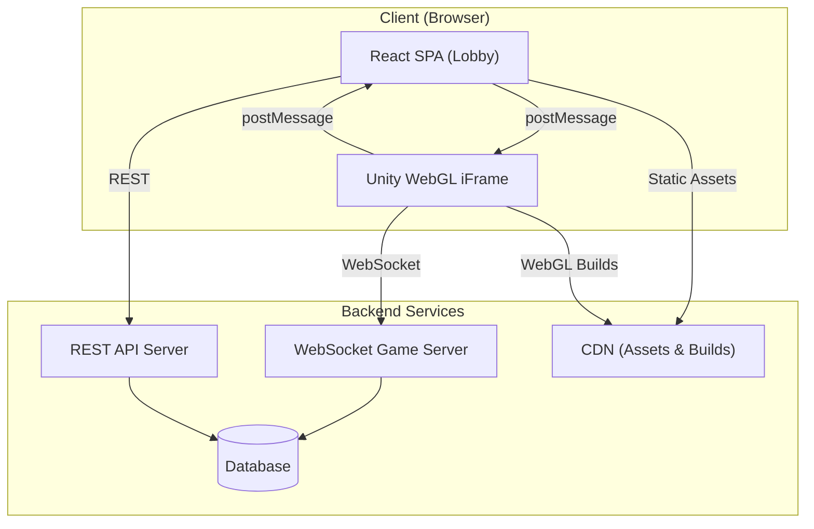

# CrashMania Clone — Lobby Specification

> **Scope**: This spec covers the **React web lobby** and its integration layer with Unity WebGL games.
> Individual game specs (Crash, Slots, etc.) will be defined separately.

---

## 1. Product Vision

Build a social casino lobby platform inspired by CrashMania. The lobby is a React SPA that:
- Displays game categories in horizontally scrollable carousels
- Supports a **dual-currency** sweepstakes model (Crash Coins + Sweep Coins)
- Hosts multiple Unity WebGL games inside iframes via a standardized message bridge
- Provides store, gifts/bonuses, account management, and a referral system

The architecture must be **game-agnostic**: adding a new game means registering a catalog entry and an iframe URL — zero lobby code changes.

---

## 2. Architecture Overview

### 2.1 High-Level System Diagram



### 2.2 Tech Stack

| Layer | Technology | Notes |
|-------|-----------|-------|
| Frontend | React 19 + Vite | SPA, client-side rendered |
| Styling | CSS Modules / Vanilla CSS | Dark theme, skew transforms |
| State | React Context + useReducer | Auth, balance, catalog |
| Game Rendering | Unity WebGL (per game) | Hosted in iframe |
| 2D Effects | PixiJS 8 (optional) | Lobby animations, coin particles |
| API | REST (Express/Fastify) | JWT auth, JSON responses |
| Real-time | WebSocket (ws/Socket.IO) | Game-specific servers |
| Database | PostgreSQL + Redis | Persistent + session/cache |
| CDN | S3 + CloudFront | Static assets, WebGL builds |
| Auth | JWT + Refresh Token | Google/Facebook OAuth + email |

### 2.3 Inspired Architecture (from LastOneOut PureMVC)

The LastOneOut project demonstrates production-grade patterns we will adapt:

| LastOneOut Pattern | Lobby Adaptation |
|---|---|
| **PureMVC Facade** (central registry) | React Context providers as the central state registry |
| **Proxies** (state & data) | Custom hooks (`useAuth`, `useBalance`, `useCatalog`) wrapping API calls |
| **Mediators** (view binding) | Container components that connect context to presentational components |
| **Commands** (business logic) | Action dispatchers / service functions decoupled from UI |
| **DI Container** (`[Inject]`) | React Context + Provider pattern for injectable services |
| **AssetMap** (typed asset lookup) | `GameRegistry` — a typed map from `gameId` to metadata, iframe URL, and thumbnail |

---

## 3. Design System

### 3.1 Color Palette

| Token | Hex | Usage |
|-------|-----|-------|
| `--bg-main` | `#282b38` | Page background |
| `--bg-card` | `#3a4250` | Card surfaces |
| `--bg-footer` | `#1a1d24` | Footer background |
| `--bg-header` | `#485364` | Header bar |
| `--brand-purple` | `#8a3dea` | Store items, premium accents |
| `--cta-blue-start` | `#4faaff` | Button gradient top |
| `--cta-blue-end` | `#1c4fc7` | Button gradient bottom |
| `--accent-yellow` | `#fedd24` | Crash Coins (CC), gold highlights |
| `--accent-green` | `#0fd250` | Sweep Coins (SC), success states |
| `--error-red` | `#ff3f3c` | Errors, danger actions |
| `--text-primary` | `#ffffff` | Primary text |
| `--text-secondary` | `#a3a8b7` | Muted/secondary text |

### 3.2 Typography

| Token | Font | Weight | Usage |
|-------|------|--------|-------|
| `--font-body` | Murecho | 400 | Body paragraphs |
| `--font-default` | Murecho SemiBold | 600 | Default UI text (div, span, label) |
| `--font-heading` | Murecho Bold | 700 | h1–h6, buttons, inputs |
| `--font-emphasis` | Murecho Black | 900 | Prices, CTAs, store values |
| `--font-display` | Saira Condensed Black | 900 | Rank numbers (Top 10 cards) |

### 3.3 Key Visual Language

| Pattern | Implementation |
|---------|---------------|
| **Skew Transform** | Buttons & cards use `transform: skew(-5deg)`, inner text counter-skewed `skew(5deg)` |
| **Gradient CTAs** | `linear-gradient(#4faaff, #1c4fc7)` — all primary action buttons |
| **Black Borders** | `2px solid #000` on store items, modal cards, and skewed elements |
| **Shimmer Loading** | Skeleton placeholders with `2s infinite` shimmer gradient animation |
| **Edge Fade Carousels** | `40px`(mobile) / `60px`(desktop) gradient masks on scroll containers |
| **Dark Glass Modals** | `backdrop-filter: blur(4px)` over `#000000b3` overlay |

### 3.4 Responsive Breakpoints

| Token | Width | Target |
|-------|-------|--------|
| `--bp-mobile` | < 600px | Mobile portrait |
| `--bp-tablet` | ≥ 600px | Large mobile / small tablet |
| `--bp-desktop` | ≥ 834px | Tablet / small desktop |
| `--bp-wide` | ≥ 1000px | Desktop |
| `--bp-xl` | ≥ 1340px | Large desktop |

**Landscape Lock**: On mobile (≤ 900px width AND coarse pointer), show a "rotate device" overlay and hide content. Exception: game pages marked `.allow-landscape`.

---

## 4. Page Structure & Routing

### 4.1 Route Map

| Route | Component | Auth Required |
|-------|-----------|:---:|
| `/` | `HomePage` (marketing landing) | ❌ |
| `/lobby` | `LobbyPage` | ✅ |
| `/game/:id` | `GamePage` (iframe host) | ✅ |
| `/store` | `StorePage` | ✅ |
| `/gifts` | `GiftsPage` | ✅ |
| `/account` | `AccountPage` | ✅ |
| `/login` | `LoginPage` | ❌ |
| `/sign-up` | `SignupPage` | ❌ |
| `/missions` | `MissionsPage` | ✅ |
| `/wheel` | `WheelPage` (mystery spin) | ✅ |
| `/invite-friends` | `ReferralPage` | ✅ |
| `/redeem` | `RedeemPage` | ✅ |
| `/privacy-policy` | `LegalPage` | ❌ |
| `/terms-of-service` | `LegalPage` | ❌ |

### 4.2 Layout Hierarchy

```
<AppShell>
  ├── <AppHeader />              # Logo + Login/Signup or Balance bar
  ├── <MainContent>              # Route-specific page
  │    └── <Outlet />
  ├── <BottomNavBar />           # Mobile: Home, Store, Gifts, Account
  └── <ModalPortal />            # Overlay modals (store drawer, welcome offer, etc.)
</AppShell>
```

### 4.3 Content Grid

```css
/* Mobile */
.main-container {
  display: grid;
  grid-template-columns: 12px 1fr 12px;
}

/* Desktop (≥834px) */
.main-container {
  grid-template-columns: minmax(50px, 1fr) minmax(auto, 1020px) minmax(50px, 1fr);
}

/* XL (≥1340px) */
.main-container {
  grid-template-columns: minmax(50px, 1fr) minmax(auto, 1200px) minmax(50px, 1fr);
}
```

---

## 5. Core Components Specification

### 5.1 AppHeader

```
┌──────────────────────────────────────────────────────┐
│  [Logo]                              [Login] [Signup]│   ← Unauthenticated
│  [Logo]              [CC 💰 250k] [SC 🟢 5.00]  [☰] │   ← Authenticated
└──────────────────────────────────────────────────────┘
Height: 63px
```

- **Logo**: 107×47px, links to `/lobby`
- **Unauthenticated**: Login (outline) + Signup (gradient fill) buttons
- **Authenticated**: Dual currency display + hamburger menu
- Button heights: `clamp(2rem, 5vh, 2.1875rem)`

### 5.2 BottomNavBar (Mobile Only, < 834px)

```
┌────────┬────────┬────────┬────────┐
│  Home  │  Store │  Gifts │ Account│
│   🏠   │   🛒   │   🎁   │   👤   │
└────────┴────────┴────────┴────────┘
```

- Fixed bottom, safe-area aware
- Active tab: brand purple icon + label
- Inactive: `--text-secondary` color

### 5.3 StickyLobbyControls

```
┌──────────────────────────────────────────────────────┐
│  [🔍 Search...]  [All] [Crash] [Slots] [Table] [New]│
└──────────────────────────────────────────────────────┘
```

- `position: sticky; top: calc(144px + env(safe-area-inset-top))`
- `z-index: 4`
- Category chips: horizontal scroll, active chip highlighted
- Search: debounced 300ms, filters game catalog client-side

### 5.4 GamesCarousel (Reusable)

```
┌──────────────────────────────────────────────────────┐
│  CATEGORY NAME                  [View All] [◄] [►]  │
│  ┌─────┐ ┌─────┐ ┌─────┐ ┌─────┐ ┌─────┐          │
│  │ img │ │ img │ │ img │ │ img │ │ img │  ◁ drag ▷ │
│  └─────┘ └─────┘ └─────┘ └─────┘ └─────┘          │
│  Name    Name    Name    Name    Name               │
└──────────────────────────────────────────────────────┘
```

**Props**: `title: string`, `games: Game[]`, `onViewAll: () => void`

- Arrow buttons: 36×36px, `skew(-5deg)`, black bg
- Track: `overflow-x: auto; scroll-snap-type: x mandatory`
- Edge fades: gradient overlays on left/right
- Gap between carousels: `18px` mobile, `22px` desktop

### 5.5 GameCard

| Property | Mobile | Tablet (≥600) | Desktop (≥834) |
|----------|--------|---------------|----------------|
| Width | 120px | 160px | 180px |
| Hover | scale(1.04) | scale(1.04) | scale(1.04) |
| Transition | 0.2s ease | 0.2s ease | 0.2s ease |

- Thumbnail: fills card width, rounded corners
- Label: `--font-default`, 14px, centered below image
- Click navigates to `/game/:id`

### 5.6 GameCard — Top 10 Variant

```
┌──────────────────────────────┐
│  ┌───┐  ┌──────────────┐    │
│  │ 1 │  │  Thumbnail   │    │
│  └───┘  └──────────────┘    │
│         Game Name            │
└──────────────────────────────┘
```

- Rank number: `--font-display` (Saira Condensed Black), large overlapping left
- Horizontal layout, `margin-left: 50px` (mobile) / `60px` (desktop)

### 5.7 StoreItemCard

```
┌─────────────────┐
│    [coin icon]   │  ← skewed card, purple bg
│   💰 250,000     │
│   + 🟢 5.00 SC   │
│  ┌────────────┐  │
│  │   $4.99    │  │  ← black price bar
│  └────────────┘  │
└─────────────────┘
```

- Background: `--brand-purple` with pattern overlay
- Border: `2px solid #000`, `border-radius: 8px`
- Transform: `skew(-2deg)` to `skew(-5deg)`
- Box shadow: `2px 2px 0 2px #000`
- Hover: `scale(1.05)`, Active: `scale(0.98)`

### 5.8 Modal / Overlay

- Overlay: `position: fixed; inset: 0; z-index: 9`
- Backdrop: `backdrop-filter: blur(4px); background: #000000b3`
- Card: `background: --bg-main; border-radius: 8px; box-shadow: 0 8px 32px rgba(0,0,0,0.5)`
- Close button: 24×24px, absolute top-right
- Width: `300px` mobile, `485px` desktop

---

## 6. Currency System

### 6.1 Dual Token Model

| Currency | Abbreviation | Color | Icon | Purpose |
|----------|:---:|-------|------|---------|
| Crash Coins | CC | `--accent-yellow` (`#fedd24`) | 💰 Gold coin | Play currency (free) |
| Sweep Coins | SC | `--accent-green` (`#0fd250`) | 🟢 Green coin | Prize currency (redeemable) |

### 6.2 Balance Display

- Always visible in header (authenticated state)
- Animated counter transitions using ease-out cubic interpolation (inspired by `AccumulateToBalanceScript.cs`)
- Tapping CC opens store; tapping SC shows redemption info

### 6.3 Currency Toggle

- Lobby supports switching between CC mode and SC mode
- Active mode determines which balance is displayed prominently and which games/bets are available
- Toggle UI: segmented control in the header area

---

## 7. Authentication Flow

### 7.1 Providers

| Provider | Method |
|----------|--------|
| Email/Password | Custom `/api/auth/` |
| Google | OAuth via `accounts.google.com/gsi/client` |
| Facebook | OAuth via `connect.facebook.net/sdk.js` |

### 7.2 Token Management

- **Access Token**: JWT, short-lived (~6h), stored in httpOnly cookie
- **Refresh Token**: Long-lived (~30d), stored in httpOnly cookie
- Auto-refresh via interceptor when API returns 401
- Token passed to Unity games via `Initialize()` message bridge

### 7.3 Auth Context (React)

```typescript
interface AuthState {
  isAuthenticated: boolean;
  user: {
    id: string;
    email: string;
    displayName: string;
    avatar?: string;
    customerFacingId: string;
  } | null;
  accessToken: string | null;
}
```

---

## 8. API Contract (Lobby-Relevant Endpoints)

### 8.1 Catalog & Lobby

| Method | Endpoint | Response |
|--------|----------|----------|
| `GET` | `/api/lobby` | `{ categories: Category[], banners: Banner[], topGames: Game[] }` |
| `GET` | `/api/catalog/games` | `Game[]` with filtering/sorting query params |
| `GET` | `/api/player` | `{ id, email, displayName, balanceCC, balanceSC, vipTier }` |

### 8.2 Store & Payments

| Method | Endpoint | Response |
|--------|----------|----------|
| `GET` | `/api/stores` | `StorePackage[]` |
| `POST` | `/api/payment` | `{ transactionId, status, redirectUrl? }` |

### 8.3 Bonuses & Rewards

| Method | Endpoint | Description |
|--------|----------|-------------|
| `GET` | `/hourly-bonus` | Timer + available amount |
| `POST` | `/hourly-bonus/claim` | Claims bonus, returns new balance |
| `GET` | `/weekly-streak-bonus` | Streak progress |
| `POST` | `/weekly-streak-bonus/claim` | Claim streak reward |
| `GET` | `/monthly-calendar-bonus` | Calendar state |
| `POST` | `/monthly-calendar-bonus/claim` | Claim calendar day |
| `GET` | `/welcome-bonus/active` | Welcome bonus availability |
| `POST` | `/welcome-bonus/claim` | Claim welcome gift |

### 8.4 Data Models

```typescript
interface Game {
  id: string;
  name: string;
  thumbnail: string;       // CDN URL
  provider: 'internal' | 'mancala' | 'slotmill' | 'ela' | 'infin';
  type: 'crash' | 'slot' | 'table' | 'instant';
  iframeUrl: string;       // WebGL build URL or provider iframe
  isNew: boolean;
  isFeatured: boolean;
  supportsSC: boolean;     // Supports Sweep Coins mode
}

interface Category {
  id: string;
  name: string;
  icon?: string;
  games: Game[];
}

interface StorePackage {
  id: string;
  coinAmount: number;
  bonusSC: number;
  priceUSD: number;
  isSpecial: boolean;
  iconUrl: string;
}

interface Banner {
  id: string;
  imageUrl: string;
  linkTo: string;          // Internal route or external URL
  priority: number;
}
```

---

## 9. Game Integration Layer (React ↔ Unity Bridge)

### 9.1 Hosting Model

Each game runs inside a sandboxed `<iframe>`. The lobby communicates via `postMessage`.

```
┌─────────────────────────────────────────┐
│  React Lobby (parent window)            │
│  ┌───────────────────────────────────┐  │
│  │  <iframe src="game.html">        │  │
│  │    Unity WebGL Instance           │  │
│  │    ┌─────────────────────┐        │  │
│  │    │  WebComManager.cs   │        │  │
│  │    └─────────────────────┘        │  │
│  └───────────────────────────────────┘  │
└─────────────────────────────────────────┘
```

### 9.2 React → Unity Messages

| Method | Event | Payload |
|--------|-------|---------|
| `Initialize` | — | `{ gameBundleId, gameId, userId, accessToken, musicOn, effectsOn, gameType, wsUrl, apiUrl }` |
| `WebToUnity` | `PLACE_BET` | `{ index, amount }` |
| `WebToUnity` | `CASH_OUT` | `{ index, amount }` |
| `WebToUnity` | `CANCEL_BET` | `{ index, amount }` |
| `WebToUnity` | `TOGGLE_SOUNDS` | `{ musicOn, effectsOn }` |
| `WebToUnity` | `EXIT_GAME` | `{}` |

### 9.3 Unity → React Messages

| Event | Payload | Lobby Action |
|-------|---------|-------------|
| `UNITY_INITIALIZED` | `null` | Show loading bar |
| `LOADING_PROGRESS` | `number` (0–1) | Update loading bar |
| `UNITY_GAME_READY` | `null` | Hide loading, reveal game |
| `GAME_START` | `null` | Disable bet controls |
| `GAME_MULTIPLIER_UPDATE` | `number` | Update sidebar multiplier display |
| `CASH_OUT_RESULT` | `{ index, amount }` | Play coin animation, update balance |
| `GAME_END` | `{ multiplier, seeds... }` | Show crash result, update history |
| `WEBSOCKET_DISCONNECTED` | `null` | Show reconnection overlay |

### 9.4 GameBridge Hook

```typescript
function useGameBridge(iframeRef: RefObject<HTMLIFrameElement>) {
  const sendToGame = (method: string, payload: object) => {
    iframeRef.current?.contentWindow?.postMessage(
      { type: 'LOBBY_TO_GAME', method, payload },
      '*'
    );
  };

  useEffect(() => {
    const handler = (event: MessageEvent) => {
      if (event.data?.type === 'GAME_TO_LOBBY') {
        // Dispatch to appropriate handler based on event.data.eventName
      }
    };
    window.addEventListener('message', handler);
    return () => window.removeEventListener('message', handler);
  }, []);

  return { sendToGame };
}
```

---

## 10. Bonus & Rewards System

### 10.1 Bonus Types

| Bonus | Frequency | Trigger | Reward |
|-------|-----------|---------|--------|
| **Welcome Gift** | Once | First login | 110,000 CC + 2 SC |
| **Hourly Bonus** | Every 2h | Timer expiry + claim | CC (amount scales with VIP) |
| **Daily Streak** | Daily | Login + claim | CC + SC (escalating 7-day streak) |
| **Monthly Calendar** | Daily (30d) | Claim each day | CC + SC, milestone weeks unlock bigger rewards |
| **Mystery Wheel** | On demand | After certain actions | Random CC/SC prize, spin animation |
| **Coinback** | Session-based | After losses | % of losses returned as CC |
| **Level Up Reward** | On level up | XP threshold | CC + SC + cosmetic unlocks |

### 10.2 Gifts Page Layout

```
┌─────────────────────────────────────────┐
│  GIFTS & BONUSES                        │
│                                         │
│  ┌─────────┐ ┌─────────┐ ┌─────────┐   │
│  │ Hourly  │ │ Daily   │ │ Wheel   │   │
│  │ ⏰ 1:42 │ │ 🔥 Day 3│ │ 🎰 Spin │   │
│  │ [CLAIM] │ │ [CLAIM] │ │ [SPIN]  │   │
│  └─────────┘ └─────────┘ └─────────┘   │
│                                         │
│  ┌───────────────────────────────────┐  │
│  │  Monthly Calendar                 │  │
│  │  [1][2][3][4][5][6][7]  Week 1   │  │
│  │  ... 🎁                           │  │
│  └───────────────────────────────────┘  │
└─────────────────────────────────────────┘
```

---

## 11. Animations Catalog

| Animation | Duration | Easing | Usage |
|-----------|----------|--------|-------|
| `fadeIn` / `fadeOut` | 300ms | ease | Page transitions, modals |
| `slideInUp` / `slideOutDown` | 300ms | ease-out | Bottom sheets, mobile overlays |
| `slideLeft` / `slideRight` | 250ms | ease | Carousel page transitions |
| `shimmer` | 2s | linear infinite | Skeleton loading placeholders |
| `spin` | 1s | linear infinite | Loading spinners |
| `scaleIn` | 200ms | ease-out | Card hover effect (1.00 → 1.04) |
| `balanceCounter` | 500ms | cubic-bezier(0.0, 0.0, 0.2, 1) | Currency display increment |
| `wheelSpin` | 3-8s | cubic-bezier(0.17, 0.67, 0.12, 0.99) | Mystery wheel deceleration |
| `coinBurst` | 600ms | ease-out | Star/coin particle on win |
| `rotatePhone` | 2s | ease-in-out infinite | Landscape lock indicator |

---

## 12. Lobby Page — Detailed Wireframe

```
┌─────────────────────────────────────────────────────────┐
│  [Logo]                    [💰 250,000] [🟢 5.00]  [☰] │  ← Header (63px)
├─────────────────────────────────────────────────────────┤
│  [🔍 Search]  [All] [Crash] [Slots] [Table] [New]      │  ← Sticky Controls
├─────────────────────────────────────────────────────────┤
│  ┌─────────────────────────────────────────────────┐    │
│  │     🎰 PROMOTIONAL BANNER CAROUSEL              │    │  ← Auto-rotate 5s
│  │     [● ○ ○]                                     │    │
│  └─────────────────────────────────────────────────┘    │
│                                                         │
│  FEATURED GAMES                        [View All] [◄►]  │
│  ┌─────┐ ┌─────┐ ┌─────┐ ┌─────┐ ┌─────┐             │
│  │     │ │     │ │     │ │     │ │     │ ◁ scroll ▷    │
│  └─────┘ └─────┘ └─────┘ └─────┘ └─────┘             │
│                                                         │
│  TOP 10                                [View All] [◄►]  │
│  ┌──────────────┐ ┌──────────────┐ ┌──────────────┐    │
│  │ 1  [thumb]   │ │ 2  [thumb]   │ │ 3  [thumb]   │    │
│  └──────────────┘ └──────────────┘ └──────────────┘    │
│                                                         │
│  CRASH GAMES                           [View All] [◄►]  │
│  ┌─────┐ ┌─────┐ ┌─────┐ ┌─────┐                      │
│  └─────┘ └─────┘ └─────┘ └─────┘                      │
│                                                         │
│  SLOT GAMES                            [View All] [◄►]  │
│  ┌─────┐ ┌─────┐ ┌─────┐ ┌─────┐                      │
│  └─────┘ └─────┘ └─────┘ └─────┘                      │
│                                                         │
│  ┌─────────────────────────────────────────────────┐    │
│  │  FOOTER: Legal links, Copyright, Social media   │    │
│  └─────────────────────────────────────────────────┘    │
└─────────────────────────────────────────────────────────┘
```

---

## 13. Game Page — Detailed Wireframe

```
┌─────────────────────────────────────────────────────────┐
│  [← Back]  CRASH  [💰 250k] [🟢 5.00]  [🔊] [🔇]      │  ← Game Header
├─────────────────────────────────────────────────────────┤
│  ┌───────────────────────────────────────────────────┐  │
│  │                                                   │  │
│  │               Unity WebGL iFrame                  │  │
│  │              (fills available space)               │  │
│  │                                                   │  │
│  └───────────────────────────────────────────────────┘  │
│  ┌───────────────────────────────────────────────────┐  │
│  │  [Auto Bet] [Manual Bet]                          │  │
│  │  Amount: [____] [½] [2×] [Max]                    │  │
│  │  Auto Cash Out: [____]x                           │  │
│  │  [          PLACE BET          ]  ← gradient CTA  │  │
│  └───────────────────────────────────────────────────┘  │
│  ┌────────────────────────┐ ┌────────────────────────┐  │
│  │  ROUND HISTORY         │ │  ACTIVE BETS           │  │
│  │  2.45x 🟢 1.00x 🔴    │ │  Player1  100 CC       │  │
│  │  3.12x 🟢 1.88x 🟢    │ │  Player2  250 CC       │  │
│  └────────────────────────┘ └────────────────────────┘  │
└─────────────────────────────────────────────────────────┘
```

---

## 14. State Management

### 14.1 Global Context Providers

```
<AuthProvider>              ← JWT tokens, user profile
  <BalanceProvider>         ← CC + SC balances, real-time updates
    <CatalogProvider>       ← Game catalog, categories, search
      <BonusProvider>       ← Bonus timers, claim states
        <SettingsProvider>  ← Sound, music, preferences
          <App />
        </SettingsProvider>
      </BonusProvider>
    </CatalogProvider>
  </BalanceProvider>
</AuthProvider>
```

### 14.2 Key Hooks

| Hook | Purpose |
|------|---------|
| `useAuth()` | Login, logout, token refresh, user profile |
| `useBalance()` | CC/SC amounts, animated transitions, real-time WebSocket sync |
| `useCatalog(category?, search?)` | Filtered game list, categories, loading states |
| `useBonus(type)` | Timer countdown, claim action, availability check |
| `useGameBridge(ref)` | postMessage bridge to Unity iframe |
| `useStore()` | Store packages, purchase flow |

---

## 15. Implementation Phases

### Phase 1: Foundation (MVP Lobby)
- [ ] React + Vite project setup with design system (CSS variables, fonts)
- [ ] Auth flow (email + Google OAuth)
- [ ] AppHeader, BottomNavBar, content grid
- [ ] `/lobby` page with static mock game catalog
- [ ] GameCard component (standard + Top 10 variant)
- [ ] GamesCarousel with horizontal scroll + edge fades
- [ ] StickyLobbyControls (search + category chips)
- [ ] `/game/:id` page with iframe hosting
- [ ] Game bridge (`useGameBridge` hook + postMessage protocol)

### Phase 2: Store & Currency
- [ ] Dual currency display in header
- [ ] Balance animation (counter interpolation)
- [ ] Currency toggle (CC / SC mode)
- [ ] Store page with StoreItemCards
- [ ] Payment integration skeleton (SafeCharge/Pay.com)

### Phase 3: Bonuses & Engagement
- [ ] Gifts page with bonus card grid
- [ ] Hourly bonus timer + claim
- [ ] Daily streak tracker
- [ ] Monthly calendar bonus
- [ ] Mystery wheel (spin animation + prize reveal)
- [ ] Welcome gift modal (FTUE flow)

### Phase 4: Social & Growth
- [ ] Account settings page
- [ ] Referral system + invite page
- [ ] Missions / challenges page
- [ ] VIP tier system
- [ ] Coinback rewards
- [ ] Rate-us prompt

### Phase 5: Polish & Production
- [ ] Skeleton loading states (shimmer)
- [ ] Error boundaries + error pages
- [ ] PWA manifest + service worker
- [ ] SEO meta tags per page
- [ ] Analytics (custom events)
- [ ] Landscape lock on mobile
- [ ] Promotional banner carousel (auto-rotate)
- [ ] Performance audit (lazy loading, code splitting)

---

## 16. File Structure (React Project)

```
src/
├── index.tsx                     # Entry point
├── App.tsx                       # Router + provider shell
├── styles/
│   ├── index.css                 # Design tokens, reset, global styles
│   ├── fonts.css                 # @font-face declarations
│   └── animations.css            # Keyframe definitions
├── contexts/
│   ├── AuthContext.tsx
│   ├── BalanceContext.tsx
│   ├── CatalogContext.tsx
│   ├── BonusContext.tsx
│   └── SettingsContext.tsx
├── hooks/
│   ├── useAuth.ts
│   ├── useBalance.ts
│   ├── useCatalog.ts
│   ├── useBonus.ts
│   ├── useGameBridge.ts
│   └── useStore.ts
├── services/
│   ├── api.ts                    # Axios/fetch instance with interceptors
│   ├── auth.ts                   # Login, register, refresh
│   ├── catalog.ts                # Lobby data, game catalog
│   ├── store.ts                  # Store packages, payments
│   └── bonus.ts                  # Bonus endpoints
├── components/
│   ├── layout/
│   │   ├── AppHeader.tsx
│   │   ├── AppHeader.css
│   │   ├── BottomNavBar.tsx
│   │   ├── BottomNavBar.css
│   │   ├── Footer.tsx
│   │   └── AppShell.tsx
│   ├── lobby/
│   │   ├── GamesCarousel.tsx
│   │   ├── GamesCarousel.css
│   │   ├── GameCard.tsx
│   │   ├── GameCard.css
│   │   ├── GameCardTop10.tsx
│   │   ├── StickyLobbyControls.tsx
│   │   ├── PromoBanner.tsx
│   │   └── SkeletonCard.tsx
│   ├── store/
│   │   ├── StoreItemCard.tsx
│   │   ├── StoreItemCard.css
│   │   └── StoreDrawer.tsx
│   ├── game/
│   │   ├── GameFrame.tsx         # iframe wrapper + bridge
│   │   ├── GameControls.tsx      # Bet controls panel
│   │   └── GameHeader.tsx
│   ├── gifts/
│   │   ├── BonusCard.tsx
│   │   ├── MysteryWheel.tsx
│   │   └── CalendarGrid.tsx
│   └── common/
│       ├── Button.tsx
│       ├── Modal.tsx
│       ├── CurrencyDisplay.tsx
│       ├── CounterAnimation.tsx
│       └── Spinner.tsx
├── pages/
│   ├── HomePage.tsx
│   ├── LobbyPage.tsx
│   ├── GamePage.tsx
│   ├── StorePage.tsx
│   ├── GiftsPage.tsx
│   ├── AccountPage.tsx
│   ├── LoginPage.tsx
│   ├── SignupPage.tsx
│   └── LegalPage.tsx
└── utils/
    ├── formatCurrency.ts
    ├── gameRegistry.ts           # Typed map: gameId → metadata + iframe URL
    └── constants.ts
```

---

## 17. Non-Functional Requirements

| Requirement | Target |
|-------------|--------|
| **First Contentful Paint** | < 1.5s |
| **Largest Contentful Paint** | < 2.5s |
| **Interaction to Next Paint** | < 200ms |
| **Bundle size (gzipped)** | < 150KB initial |
| **Game iframe load** | < 5s (with loading bar) |
| **API response time** | < 300ms (p95) |
| **WebSocket latency** | < 100ms (same region) |
| **Uptime** | 99.9% |
| **Supported browsers** | Chrome 90+, Safari 15+, Firefox 90+, Edge 90+ |
| **Mobile support** | iOS 15+, Android 10+ (PWA) |

---

## 18. Security Considerations

- All API calls over HTTPS
- JWT tokens in httpOnly, Secure, SameSite=Strict cookies
- CSRF protection via double-submit cookie pattern
- Rate limiting on auth endpoints (5 req/min)
- Game outcomes calculated server-side only (Provably Fair)
- Input validation on all bet amounts (min/max, integer cents)
- iframe sandbox attributes for third-party game providers
- CSP headers restricting script sources

---

## 19. Open Questions

1. **Backend framework**: Express.js vs Fastify vs NestJS? (Recommend Fastify for perf)
2. **Database**: PostgreSQL sufficient or do we need a dedicated time-series DB for game history?
3. **Payment processor**: SafeCharge sandbox available? Or start with Stripe for MVP?
4. **Hosting**: AWS (ECS + RDS + ElastiCache) or Vercel (frontend) + Railway (backend)?
5. **Game providers**: Do we build all games in-house (Unity) or also integrate third-party iframe providers?
6. **KYC**: Required for SC redemptions — integrate Sumsub from Phase 1 or defer?
